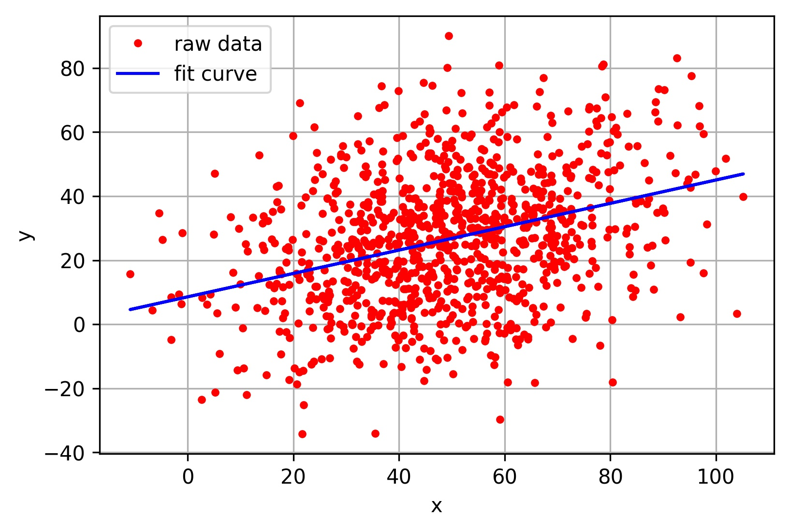
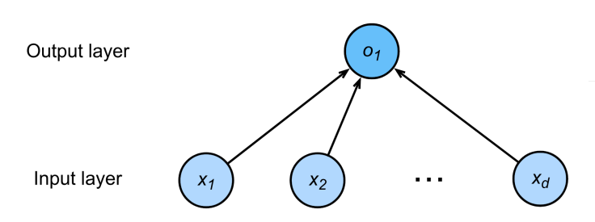

# 回归算法

<!-- @import "[TOC]" {cmd="toc" depthFrom=2 depthTo=6 orderedList=false} -->

<!-- code_chunk_output -->

- [〇. 基础内容](#〇-基础内容)
- [一. 回归算法的分类](#一-回归算法的分类)
- [二. 线性回归](#二-线性回归)
  - [2.1 模型示例](#21-模型示例)
  - [2.2 线性模型和神经网络](#22-线性模型和神经网络)
  - [2.3 损失函数](#23-损失函数)

<!-- /code_chunk_output -->

## 〇. 基础内容
1. 回归算法的图示
    

## 一. 回归算法的分类
1. 线性回归
2. 逻辑回归
3. 多元自适应回归（MARS）
4. 本地散点平滑估计（LOESS）

## 二. 线性回归
简述:
+ 回归(regression)是 **一个或多个自变量** 与 **因变量** 之间关系建模方法

### 2.1 模型示例
目标(房屋价格)可以表示为特征(面积和房龄)的加权和，如下面的式子:
$$
\begin{aligned}
price
& = w_{area} \cdot area + w_{age} \cdot age + b
\tag{2-1}
\end{aligned}
$$
+ $w_{area}$ 和 $w_{age}$ 称为权重, 权重决定了每个特征对我们预测值的影响
+ $b$ 称为偏置(bias), 偏移量(offset)或截距(intercept)
    - 偏置是指当所有特征都取值为0时，预测值应该为多少。 (即使现实中不会有任何房子的面积是0或房龄正好是0年，我们仍然需要偏置项) 
    - 如果没有偏置项，我们模型的表达能力将受到限制

严格来说， (1-1-1)是输入特征的一个 仿射变换(affine transformation). 仿射变换的特点是通过加权和对特征进行线性变换(linear transformation)， 并通过偏置项来进行平移(translation).  

给定一个数据集，我们的目标是寻找模型的权重 $w$ 和偏置 $b$, 使得根据模型做出的预测大体符合数据里的真实价格. 输出的预测值由输入特征通过线性模型的仿射变换决定, 仿射变换由所选权重和偏置确定.

上式用线性代数表示法会比较方便. 当我们的输入包含 $d$ 个特征时，我们将预测结果 $\hat{y}$  (通常使用"尖角"符号表示 $y$ 的估计值)表示为：
$$
\hat{y}=w_1 \cdot x_1 + ... + w_d \cdot x_d + b
\tag{2-2-1} 
$$
或者用点积形式来简洁地表达模型：
$$
\hat{y}=w^⊤ x+b
\tag{2-2-2}
$$

### 2.2 线性模型和神经网络
线性模型可以看成一个**单层的神经网络**

有d个输入分别为$x_1, x_2, \cdots x_d$, 箭头表示权重

### 2.3 损失函数
> 更多见<机器学习基础内容.md>
1. 损失函数的作用
    衡量预估的质量. 比较真实值和预估值.
    例如, 房产的成交价和估价
    设, $y$是真实值, $\hat{y}$是预估值, 
    则有平方损失函数
    $$
    l(y, \hat{y}) = \frac{1}{2} (y-\hat{y})^2
    \tag{2-3}
    $$

2. 损失函数示例
    1. 收集训练数据
        一些数据点来决定参数值(权重和偏差), 例如过去6个月卖的房子的数据, 这被称之为训练数据. 
        假设我们有 n 个样本，记为
        + 真实房价:    
            $$
            y = [\ y_1, y_2, \cdots, y_n\ ]^T
            \tag{2-4-1}
            $$
        + 预测值: 
            $$
            X = [\ x_1, x_2, \cdots, x_n\ ]^T
            $$设分别对应的权重为$[w_1, w_2, \cdots w_n]$偏移量为$b$, 又根据式(2-2-2)得房价预估值为   
            $$
            \begin{aligned}
            \hat{y}
            &= w_1 \cdot x_1 + ... + w_n \cdot x_n + b \\
            &= \lang x_i, w\rang - b
            \tag{2-4-2}
            \end{aligned}
            $$
        
    2. 训练损失
        根据上式, 得损失的均值
        $$
        \begin{aligned}
        L(X, y, w, b) 
        &= \frac{ \frac{1}{2}(y_1-\hat{y_1})^2 + \frac{1}{2}(y_2-\hat{y_2})^2 + \cdots +  \frac{1}{2}(y_n-\hat{y_n})^2 }{n} \\
        &= \frac{1}{2n} \sum_{i=1}^n (y_i - \lang x_i, w\rang - b)^2 \\
        &= \frac{1}{2n} \lVert y - X \cdot w - b\rVert ^2
        \tag{2-5}
        \end{aligned}
        $$
        然后, 求出最小化损失来学习参数
        $$
        w^*, b^* = arg\ min_{w, b}\ L(X, y, w, b) 
        \tag{2-6}
        $$
        式(2-6)的$w^*, b^*$就是可以最小化损失的参数

    
    
        

    

        

