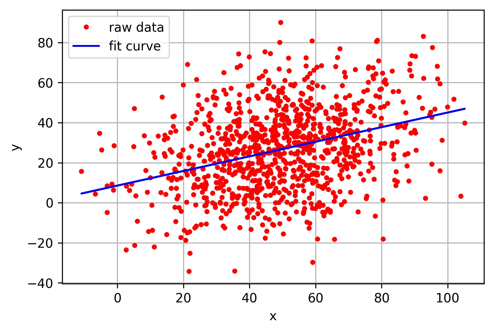
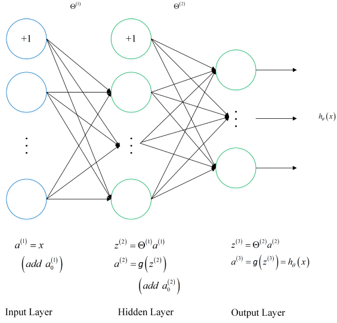
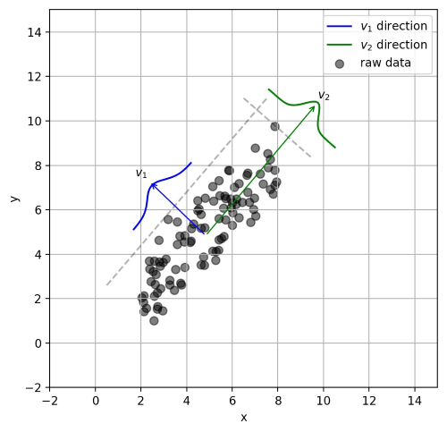

# 机器学习概述

<!-- @import "[TOC]" {cmd="toc" depthFrom=2 depthTo=6 orderedList=false} -->

<!-- code_chunk_output -->

- [一. 机器学习概述](#一-机器学习概述)
- [二. 机器学习的分类](#二-机器学习的分类)
  - [A. 按功能分类](#a-按功能分类)
  - [B. 按学习方式分类](#b-按学习方式分类)
- [三. 分类算法的评估方法](#三-分类算法的评估方法)
  - [3.1 常用术语](#31-常用术语)
  - [3.2 评价指标](#32-评价指标)
  - [3.3 ROC曲线 和 PR曲线](#33-roc曲线-和-pr曲线)
  - [3.x 正确率能很好的评估分类算法吗](#3x-正确率能很好的评估分类算法吗)
  - [3.y 什么样的分类器是最好的](#3y-什么样的分类器是最好的)
- [四. 损失函数](#四-损失函数)
- [4.1 损失函数](#41-损失函数)
- [4.2 常见的损失函数](#42-常见的损失函数)
  - [4.2.1 0-1损失函数](#421-0-1损失函数)
  - [4.2.2 绝对值损失函数](#422-绝对值损失函数)
  - [4.2.3 平方损失函数](#423-平方损失函数)
  - [4.2.4 对数损失函数](#424-对数损失函数)
  - [4.2.5 指数损失函数](#425-指数损失函数)
  - [4.2.6 Hinge损失函数](#426-hinge损失函数)
- [4.3 逻辑回归为什么使用对数损失函数](#43-逻辑回归为什么使用对数损失函数)
- [4.4 对数损失函数是如何度量损失的](#44-对数损失函数是如何度量损失的)

<!-- /code_chunk_output -->

## 一. 机器学习概述
机器学习(Machine Learning, ML)，顾名思义，让机器去学习。这里，机器指的是计算机，是算法运行的物理载体，你也可以把各种算法本身当做一个有输入和输出的机器。那么到底让计算机去学习什么呢？对于一个任务及其表现的度量方法，设计一种算法，让算法能够提取中数据所蕴含的规律，这就叫机器学习。

## 二. 机器学习的分类
### A. 按功能分类
支持向量机，回归，决策树，随机森林，强化方法，集成学习，深度学习  
下面有常见算法的示意图

> 算法的分类: 分类算法和回归算法是对真实世界不同建模的方法。
**分类模型**是认为模型的输出是离散的，例如大自然的生物被划分为不同的种类，是离散的。
**回归模型**的输出是连续的，例如人的身高变化过程是一个连续过程，而不是离散的。

| 类型 | 常见子类 |
| - | - |
| 回归算法 | 线性回归, 逻辑回归, 多元自适应回归(MARS), 本地散点平滑估计(LOESS) | 
| 基于实例的学习算法 | K - 邻近算法(kNN), 学习矢量化(LVQ), 自组织映射算法(SOM), 局部加权学习算法(LWL)|
| 正则化算法 | 岭回归(Ridge Regression), LASSO(Least Absolute Shrinkage and Selection Operator), Elastic Net, 最小角回归(LARS)|
| 决策树算法 | 分类和回归树(CART), ID3 算法 (Iterative Dichotomiser 3), C4.5 和 C5.0, CHAID(Chi-squared Automatic Interaction Detection)， 随机森林(Random Forest), 多元自适应回归样条(MARS), 梯度推进机(Gradient Boosting Machine， GBM) |
| 贝叶斯算法 | 朴素贝叶斯, 高斯朴素贝叶斯, 多项式朴素贝叶斯, AODE(Averaged One-Dependence Estimators), 贝叶斯网络(Bayesian Belief Network) | 
| 基于核的算法 | 支持向量机(SVM), 径向基函数(Radial Basis Function, RBF), 线性判别分析(Linear Discriminate Analysis, LDA) |
| 聚类算法 | K-均值, K-中位数, EM 算法, 分层聚类 |
| 关联规则学习 | Apriori 算法 | Eclat 算法 |
| 神经网络 | 感知器, 反向传播算法(BP), Hopfield 网络, 径向基函数网络(RBFN) |
| 深度学习 | 深度玻尔兹曼机(DBM), 卷积神经网络(CNN), 递归神经网络(RNN、LSTM), 栈式自编码算法(Stacked Auto-Encoder) |
| 降维算法 | 主成分分析法(PCA), 主成分回归(PCR), 偏最小二乘回归(PLSR), 萨蒙映射, 多维尺度分析法(MDS), 投影寻踪法(PP), 线性判别分析法(LDA), 混合判别分析法(MDA), 二次判别分析法(QDA), 灵活判别分析法(Flexible Discriminant Analysis，FDA |
| 集成算法 | Boosting, Bagging, AdaBoost, 堆叠泛化(混合), GBM 算法, GBRT 算法, 随机森林|
| 其他算法 | 特征选择算法, 性能评估算法, 自然语言处理, 计算机视觉, 推荐系统, 强化学习, 迁移学习 |

| 算法名 | 图示 | 优点 | 缺点 | 
| :-: | :-: | :- | :- |
| 回归算法 |  | | |
| 聚类算法 |  |
| 正则化方法 |  |
| 决策树学习 |  | 1)不需要任何领域知识或参数假设。 2)适合高维数据。 3)简单易于理解。 4)短时间内处理大量数据，得到可行且效果较好的结果。 5)能够同时处理数据型和常规性属性。|1)对于各类别样本数量不一致数据，信息增益偏向于那些具有更多数值的特征。 2)易于过拟合。 3)忽略属性之间的相关性。 4)不支持在线学习。|
| 贝叶斯方法 |  |
| 基于核的算法 |  |
| 聚类算法 |  |
| 关联规则学习 |  |
| 人工神经网络 |  |
| 深度学习 |  |
| 降低维度算法 |  |
| 集成算法 |  | | |
| Bayes 贝叶斯分类法 | |1)所需估计的参数少，对于缺失数据不敏感。 2)有着坚实的数学基础，以及稳定的分类效率。|1)需要假设属性之间相互独立，这往往并不成立。(喜欢吃番茄、鸡蛋，却不喜欢吃番茄炒蛋)。 2)需要知道先验概率。 3)分类决策存在错误率。|
| Decision Tree决策树 | | 1)不需要任何领域知识或参数假设。 2)适合高维数据。 3)简单易于理解。 4)短时间内处理大量数据，得到可行且效果较好的结果。 5)能够同时处理数据型和常规性属性。|1)对于各类别样本数量不一致数据，信息增益偏向于那些具有更多数值的特征。 2)易于过拟合。 3)忽略属性之间的相关性。 4)不支持在线学习。|
|SVM支持向量机 | | 1)可以解决小样本下机器学习的问题。 2)提高泛化性能。 3)可以解决高维、非线性问题。超高维文本分类仍受欢迎。 4)避免神经网络结构选择和局部极小的问题。|1)对缺失数据敏感。 2)内存消耗大，难以解释。 3)运行和调参略烦人。|
| KNN K近邻 | | 1)思想简单，理论成熟，既可以用来做分类也可以用来做回归；  2)可用于非线性分类；  3)训练时间复杂度为O(n)；  4)准确度高，对数据没有假设，对outlier不敏感；|1)计算量太大。 2)对于样本分类不均衡的问题，会产生误判。 3)需要大量的内存。 4)输出的可解释性不强。|
|Logistic Regression逻辑回归 | | 1)速度快。 2)简单易于理解，直接看到各个特征的权重。 3)能容易地更新模型吸收新的数据。 4)如果想要一个概率框架，动态调整分类阀值。|特征处理复杂。需要归一化和较多的特征工程。|
| Neural Network 神经网络| | 1)分类准确率高。 2)并行处理能力强。 3)分布式存储和学习能力强。 4)鲁棒性较强，不易受噪声影响。|1)需要大量参数(网络拓扑、阀值、阈值)。 2)结果难以解释。 3)训练时间过长。|
| Adaboosting | | 1)adaboost是一种有很高精度的分类器。 2)可以使用各种方法构建子分类器，Adaboost算法提供的是框架。 3)当使用简单分类器时，计算出的结果是可以理解的。而且弱分类器构造极其简单。 4)简单，不用做特征筛选。 5)不用担心overfitting。|对outlier比较敏感|

### B. 按学习方式分类
分为
1. 监督学习：输入数据带**有标签**。监督学习建立一个学习过程，将预测结果与 “训练数据”(即输入数据)的实际结果进行比较，不断的调整预测模型，直到模型的预测结果达到一个预期的准确率，比如分类和回归问题等。常用算法包括决策树、贝叶斯分类、最小二乘回归、逻辑回归、支持向量机、神经网络等。

2. 非监督学习：输入数据**没有标签**，而是通过算法来推断数据的内在联系，比如聚类和关联规则学习等。常用算法包括独立成分分析、K-Means 和 Apriori 算法等。

3. 半监督学习：输入数据**部分标签**，是监督学习的延伸，常用于分类和回归。常用算法包括图论推理算法、拉普拉斯支持向量机等。

4. 强化学习：输入数据作为对模型的反馈，强调如何基于环境而行动，以取得最大化的预期利益。与监督式学习之间的区别在于，它并不需要出现正确的输入 / 输出对，也不需要精确校正次优化的行为。强化学习更加专注于在线规划，需要在探索(在未知的领域)和遵从(现有知识)之间找到平衡。

## 三. 分类算法的评估方法
​分类评估方法主要功能是用来评估分类算法的好坏，而评估一个分类器算法的好坏又包括许多项指标。了解各种评估方法，在实际应用中选择正确的评估方法是十分重要的。
### 3.1 常用术语
几个常见的模型评价术语，现在假设我们的分类目标只有两类，计为正例(positive)和负例(negative)分别是：
1. True positives(TP):  被正确地划分为正例的个数，即实际为正例且被分类器划分为正例的实例数；
2. False positives(FP): 被错误地划分为正例的个数，即实际为负例但被分类器划分为正例的实例数；
3. False negatives(FN):被错误地划分为负例的个数，即实际为正例但被分类器划分为负例的实例数；
4. True negatives(TN): 被正确地划分为负例的个数，即实际为负例且被分类器划分为负例的实例数。　

这四个术语的混淆矩阵，做以下说明：
+ P=TP+FN 表示实际为正例的样本个数。
+ True、False描述的是分类器是否判断正确。
+ Positive、Negative是分类器的分类结果，如果正例计为1、负例计为-1，即positive=1、negative=-1。用1表示True，-1表示False，那么实际的类标=TF\*PN，TF为true或false，PN为positive或negative。
+ 例如True positives(TP)的实际类标=1\*1=1为正例，False positives(FP)的实际类标=(-1)\*1=-1为负例，False negatives(FN)的实际类标=(-1)\*(-1)=1为正例，True negatives(TN)的实际类标=1\*(-1)=-1为负例。

### 3.2 评价指标
1. 正确率(accuracy)
    正确率是我们最常见的评价指标，
    $$
    accuracy = \frac{(TP+TN)}{(P+N)}
    $$正确率是被分对的样本数在所有样本数中的占比，通常来说，正确率越高，分类器越好。
2. 错误率(error rate)
  	错误率则与正确率相反，描述被分类器错分的比例，
    $$
    error\ rate = \frac{(FP+FN)}{(P+N)}
    $$对某一个实例来说，分对与分错是互斥事件，所以$accuracy =1 -  error\ rate$
3. 灵敏度(sensitivity)
  	$$
    sensitivity = \frac{TP}{P}
    $$表示的是所有正例中被分对的比例，衡量了分类器对正例的识别能力。
4. 特异性(specificity)
  	$$
    specificity = \frac{TN}{N}
    $$表示的是所有负例中被分对的比例，衡量了分类器对负例的识别能力。
5. 精度(precision)
  	$$
    precision = \frac{TP}{(TP+FP)}
    $$精度是精确性的度量，表示被分为正例的示例中实际为正例的比例。
6. 召回率(recall)
  	召回率是覆盖面的度量，度量有多个正例被分为正例，
    $$
    recall = TP/(TP+FN)=TP/P=sensitivity
    $$可以看到召回率与灵敏度是一样的。
7. 其他评价指标
    + 计算速度：分类器训练和预测需要的时间；
  	+ 鲁棒性：处理缺失值和异常值的能力；
  	+ 可扩展性：处理大数据集的能力；
  	+ 可解释性：分类器的预测标准的可理解性，像决策树产生的规则就是很容易理解的，而神经网络的一堆参数就不好理解，我们只好把它看成一个黑盒子。
8. 精度和召回率
    反映了分类器分类性能的两个方面. 如果综合考虑查准率与查全率，可以得到新的评价指标$F1-score$，也称为综合分类率：
    $$
    F1=\frac{2 \times precision \times recall}{precision + recall}​
    $$

9. 微平均F1(micro-averaging)和宏平均F1(macro-averaging)  
		为了综合多个类别的分类情况，评测系统整体性能，经常采用的还有两种指标。
		1. 宏平均F1与微平均F1是以两种不同的平均方式求的全局F1指标。
		2. 宏平均F1的计算方法先对每个类别单独计算F1值，再取这些F1值的算术平均值作为全局指标。
		3. 微平均F1的计算方法是先累加计算各个类别的a、b、c、d的值，再由这些值求出F1值。
		4. 由两种平均F1的计算方式不难看出，宏平均F1平等对待每一个类别，所以它的值主要受到稀有类别的影响，而微平均F1平等考虑文档集中的每一个文档，所以它的值受到常见类别的影响比较大。

### 3.3 ROC曲线 和 PR曲线
1. ROC曲线
    + Receiver Operating Characteristic Curve，受试者工作特征曲线的简称
    + 灵敏度(真阳性率)为纵坐标，1减去特异性(假阳性率)为横坐标的性能评价曲线
    + 可以将不同模型对同一数据集的ROC曲线绘制在同一笛卡尔坐标系中，ROC曲线越靠近左上角，说明其对应模型越可靠。也可以通过ROC曲线下面的面积(Area Under Curve, AUC)来评价模型，AUC越大，模型越可靠。
  

2. ​PR曲线
    + Precision Recall Curve的简称，
    + 描述的是precision和recall之间的关系，以recall为横坐标，precision为纵坐标绘制的曲线。
    + 该曲线的所对应的面积AUC实际上是目标检测中常用的评价指标平均精度(Average Precision, AP)。AP越高，说明模型性能越好。

### 3.x 正确率能很好的评估分类算法吗

​	不同算法有不同特点，在不同数据集上有不同的表现效果，根据特定的任务选择不同的算法。如何评价分类算法的好坏，要做具体任务具体分析。对于决策树，主要用正确率去评估，但是其他算法，只用正确率能很好的评估吗？
​	答案是否定的。
​	正确率确实是一个很直观很好的评价指标，但是有时候正确率高并不能完全代表一个算法就好。比如对某个地区进行地震预测，地震分类属性分为0：不发生地震、1发生地震。我们都知道，不发生的概率是极大的，对于分类器而言，如果分类器不加思考，对每一个测试样例的类别都划分为0，达到99%的正确率，但是，问题来了，如果真的发生地震时，这个分类器毫无察觉，那带来的后果将是巨大的。很显然，99%正确率的分类器并不是我们想要的。出现这种现象的原因主要是数据分布不均衡，类别为1的数据太少，错分了类别1但达到了很高的正确率缺忽视了研究者本身最为关注的情况。

### 3.y 什么样的分类器是最好的
​	对某一个任务，某个具体的分类器不可能同时满足或提高所有上面介绍的指标。
​	如果一个分类器能正确分对所有的实例，那么各项指标都已经达到最优，但这样的分类器往往不存在。比如之前说的地震预测，既然不能百分百预测地震的发生，但实际情况中能容忍一定程度的误报。假设在1000次预测中，共有5次预测发生了地震，真实情况中有一次发生了地震，其他4次则为误报。正确率由原来的999/1000=99.9下降为996/1000=99.6。召回率由0/1=0%上升为1/1=100%。对此解释为，虽然预测失误了4次，但真的地震发生前，分类器能预测对，没有错过，这样的分类器实际意义更为重大，正是我们想要的。在这种情况下，在一定正确率前提下，要求分类器的召回率尽量高。

## 四. 损失函数
## 4.1 损失函数
损失函数(Loss Function), 又叫做误差函数，用来衡量算法的运行情况，估量模型的预测值与真实值的不一致程度.
+ 损失函数是一个非负实值函数
+ 设 $y$ 是真实值, $\hat{y}$ 是预估值通常使用$L(y, \hat{y})​$来表示.
  例如, 房产的成交价和估价
  设, $y$是真实成交价, $\hat{y}$是预估成交价, 
  则有平方损失函数
  $$
  l(y, \hat{y}) = \frac{1}{2} (y-\hat{y})^2
  $$
+ 损失函数越小，模型的鲁棒性就越好。损失函数是经验风险函数的核心部分，也是结构风险函数重要组成部分。

## 4.2 常见的损失函数
​机器学习通过对算法中的目标函数进行不断求解优化，得到最终想要的结果。分类和回归问题中，**通常使用损失函数或代价函数作为目标函数**.
​损失函数用来评价预测值和真实值不一样的程度。通常损失函数越好，模型的性能也越好。
​损失函数可分为经验风险损失函数和结构风险损失函数。经验风险损失函数指预测结果和实际结果的差别，结构风险损失函数是在经验风险损失函数上加上正则项。
​下面介绍常用的损失函数：

### 4.2.1 0-1损失函数
如果预测值和目标值相等，值为0，如果不相等，值为1。
$$
L(Y, f(x)) =
\begin{cases}
1,& Y\ne f(x)\\
0,& Y = f(x)
\end{cases}
$$

一般的在实际使用中，相等的条件过于严格，可适当放宽条件：
$$
L(Y, f(x)) =
\begin{cases}
1,& |Y-f(x)|\geqslant T\\
0,& |Y-f(x)|< T
\end{cases}
$$

### 4.2.2 绝对值损失函数
和0-1损失函数相似，绝对值损失函数表示为：
$$
L(Y, f(x)) = |Y-f(x)|​
$$

### 4.2.3 平方损失函数
$$
L(Y, f(x)) = \sum_N{(Y-f(x))}^2
$$

这点可从最小二乘法和欧几里得距离角度理解。最小二乘法的原理是，最优拟合曲线应该使所有点到回归直线的距离和最小。

### 4.2.4 对数损失函数
$$
L(Y, P(Y|X)) = -\log{P(Y|X)}
$$

​	常见的逻辑回归使用的就是对数损失函数，有很多人认为逻辑回归的损失函数是平方损失，其实不然。逻辑回归它假设样本服从伯努利分布（0-1分布），进而求得满足该分布的似然函数，接着取对数求极值等。逻辑回归推导出的经验风险函数是最小化负的似然函数，从损失函数的角度看，就是对数损失函数。

### 4.2.5 指数损失函数
指数损失函数的标准形式为：
$$
L(Y, f(x)) = \exp(-Yf(x))
$$

例如AdaBoost就是以指数损失函数为损失函数。

### 4.2.6 Hinge损失函数
Hinge损失函数的标准形式如下：
$$
L(y) = \max{(0, 1-ty)}
$$

统一的形式：
$$
L(Y, f(x)) = \max{(0, Yf(x))}
$$

其中y是预测值，范围为(-1,1)，t为目标值，其为-1或1。

在线性支持向量机中，最优化问题可等价于

$$
\underset{\min}{w,b}\sum_{i=1}^N (1-y_i(wx_i+b))+\lambda\Vert w\Vert ^2
$$

上式相似于下式

$$
\frac{1}{m}\sum_{i=1}^{N}l(wx_i+by_i) + \Vert w\Vert ^2
$$

其中$l(wx_i+by_i)$是Hinge损失函数，$\Vert w\Vert ^2$可看做为正则化项。

## 4.3 逻辑回归为什么使用对数损失函数
假设逻辑回归模型
$$
P(y=1|x;\theta)=\frac{1}{1+e^{-\theta^{T}x}}
$$
假设逻辑回归模型的概率分布是伯努利分布，其概率质量函数为：
$$
P(X=n)=
\begin{cases}
1-p, n=0\\
 p,n=1
\end{cases}
$$
其似然函数为：
$$
L(\theta)=\prod_{i=1}^{m}
P(y=1|x_i)^{y_i}P(y=0|x_i)^{1-y_i}
$$
对数似然函数为：
$$
\ln L(\theta)=\sum_{i=1}^{m}[y_i\ln{P(y=1|x_i)}+(1-y_i)\ln{P(y=0|x_i)}]\\
  =\sum_{i=1}^m[y_i\ln{P(y=1|x_i)}+(1-y_i)\ln(1-P(y=1|x_i))]
$$
对数函数在单个数据点上的定义为：
$$
cost(y,p(y|x))=-y\ln{p(y|x)-(1-y)\ln(1-p(y|x))}
$$
则全局样本损失函数为：
$$
cost(y,p(y|x)) = -\sum_{i=1}^m[y_i\ln p(y_i|x_i)+(1-y_i)\ln(1-p(y_i|x_i))]
$$
由此可看出，对数损失函数与极大似然估计的对数似然函数本质上是相同的。所以逻辑回归直接采用对数损失函数。

## 4.4 对数损失函数是如何度量损失的
​例如，在高斯分布中，我们需要确定均值和标准差。
​如何确定这两个参数？最大似然估计是比较常用的方法。最大似然的目标是找到一些参数值，这些参数值对应的分布可以最大化观测到数据的概率。
​因为需要计算观测到所有数据的全概率，即所有观测到的数据点的联合概率。现考虑如下简化情况：

1. 假设观测到每个数据点的概率和其他数据点的概率是独立的

2. 取自然对数。
  假设观测到单个数据点$x_i(i=1,2,...n)$的概率为：
  $$
  P(x_i;\mu,\sigma)=\frac{1}{\sigma \sqrt{2\pi}}\exp 
      \left( - \frac{(x_i-\mu)^2}{2\sigma^2} \right)
  $$

3. 其联合概率为：
    $$
    P(x_1,x_2,...,x_n;\mu,\sigma)=\frac{1}{\sigma \sqrt{2\pi}}\exp 
        \left( - \frac{(x_1-\mu)^2}{2\sigma^2} \right) \\ \times
        \frac{1}{\sigma \sqrt{2\pi}}\exp 
        \left( - \frac{(x_2-\mu)^2}{2\sigma^2} \right) \times ... \times
        \frac{1}{\sigma \sqrt{2\pi}}\exp 
        \left( - \frac{(x_n-\mu)^2}{2\sigma^2} \right)
    $$
    ​	对上式取自然对数，可得：
    $$
    \ln(P(x_1,x_2,...x_n;\mu,\sigma))=
        \ln \left(\frac{1}{\sigma \sqrt{2\pi}} \right) 
        - \frac{(x_1-\mu)^2}{2\sigma^2}  \\ +
        \ln \left( \frac{1}{\sigma \sqrt{2\pi}} \right) 
        - \frac{(x_2-\mu)^2}{2\sigma^2} +...+
        \ln \left( \frac{1}{\sigma \sqrt{2\pi}} \right) 
        - \frac{(x_n-\mu)^2}{2\sigma^2}
    $$
    根据对数定律，上式可以化简为：
    $$
    \ln(P(x_1,x_2,...x_n;\mu,\sigma))=-n\ln(\sigma)-\frac{n}{2} \ln(2\pi)\\
          -\frac{1}{2\sigma^2}[(x_1-\mu)^2+(x_2-\mu)^2+...+(x_n-\mu)^2]
    $$
    然后求导为：
    $$
    \frac{\partial\ln(P(x_1,x_2,...,x_n;\mu,\sigma))}{\partial\mu}=
              \frac{n}{\sigma^2}[\mu - (x_1+x_2+...+x_n)]
    $$
    ​     上式左半部分为对数损失函数。损失函数越小越好，因此我们令等式左半的对数损失函数为0，可得：
    $$
    \mu=\frac{x_1+x_2+...+x_n}{n}
    $$
    同理，可计算$\sigma ​$。

