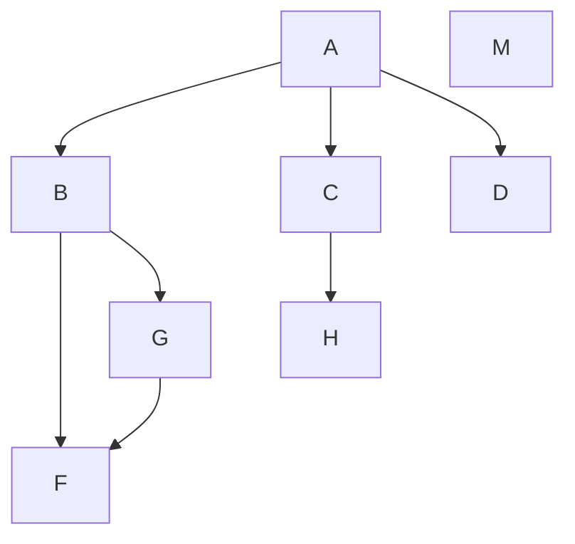
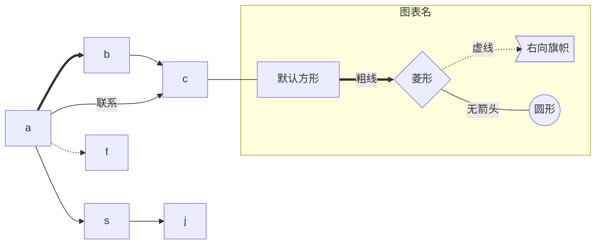
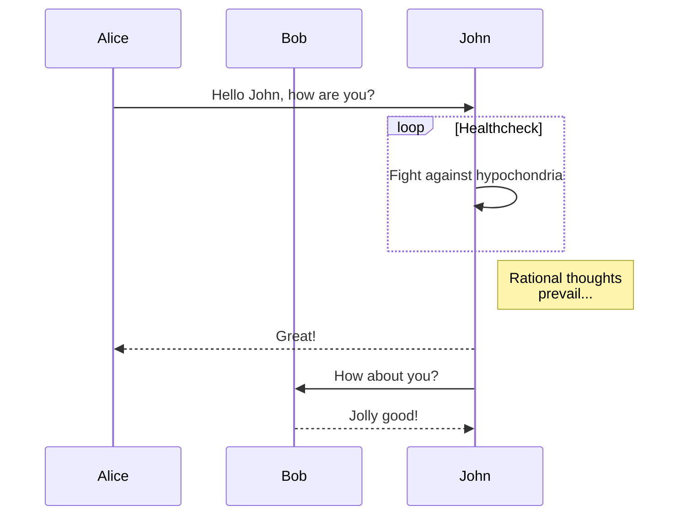
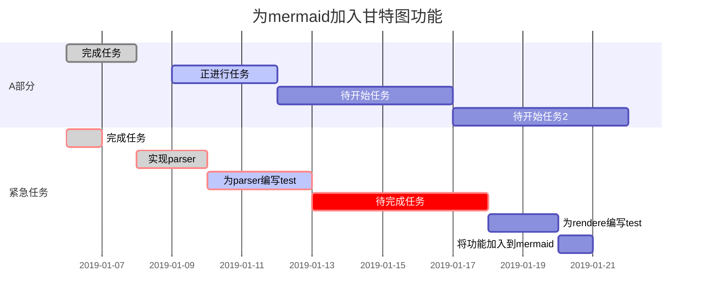

# 关于插件Markdown Preview Enhanced（MPE）的使用技巧 -MarkDown
> https://shd101wyy.github.io/markdown-preview-enhanced/#/zh-cn/
---
目录：

<!-- @import "[TOC]" {cmd="toc" depthFrom=1 depthTo=6 orderedList=false} -->

<!-- code_chunk_output -->

- [关于插件Markdown Preview Enhanced（MPE）的使用技巧](#关于插件markdown-preview-enhancedmpe的使用技巧)
  - [0. Preview（预览）](#0-preview预览)
  - [1. 关于TOC](#1-关于toc)
  - [2. 绘制流程图](#2-绘制流程图)
    - [2.0 简介](#20-简介)
      - [2.1 flow](#21-flow)
      - [2.2 mermaid](#22-mermaid)
        - [2.2.0 配置绘图主题颜色](#220-配置绘图主题颜色)
        - [2.2.1 Flowchart（流程图）](#221-flowchart流程图)
        - [2.2.2 Sequence diagram(顺序图)](#222-sequence-diagram顺序图)
        - [2.2.3 甘特图(Gantt diagram)](#223-甘特图gantt-diagram)

<!-- /code_chunk_output -->

## 0. Preview（预览）
如果已经安装 MPE 插件后有两种MarkDown预览(Preview)方式：VScode自带的Preview和 MPE Preview。  
两种预览方式打开方式：  
+ **VScode Preview**: 普通的预览就可以。

+ **MPE Preview**：鼠标右键 选择 "MarkDown Preview ENhanced: Open Preview to the Side" 或者用快捷键： command/ctrl + shift + v  

**MPE Preview优点**：   
1. ==支持荧光字体==
    ```
    ==字体==
    ```
2. 可保存为PDF  
    在预览界面手手表右键，选择"Chrome(Pupptteer)"->"PDF/"；
3. 编译保存为html
    在预览界面手手表右键，选择"HTML"->"HTML"；


---
## 1. 关于TOC 
&ensp; &ensp; **生成目录**:  
&ensp; &ensp; &ensp; &ensp; **Step1**: 将光标放在要插入目录的地方；  
&ensp; &ensp; &ensp; &ensp; **Step2**: 按快捷键：cmd + shift + p；  
&ensp; &ensp; &ensp; &ensp; **Step3**: 选择（直接搜索也可）：Markdown Preview Enhanced: Create Toc  
&ensp; &ensp; &ensp; &ensp; **Step4**: 将自动在光标位置插入目录代码，如何文章继续写新的标题也会自动增加；  

> 1. 自动生成代码中：depthFrom=1 depthTo=6表示从一级标题到六级标题；
> 2. 生成目录后，需要预览后再保存；

&ensp;   
 
---
## 2. 绘制流程图
> &ensp; &ensp; 首先，打开 MPE Preview，否则无法显示：鼠标右键 选择 "MarkDown Preview ENhanced:Open Preview to the Side" 或者用快捷键： command/ctrl + shift + v
### 2.0 简介  
    有很多绘图引擎，下面将介绍两个：flow 和 mermaid。
#### 2.1 flow
参考链接：https://www.jianshu.com/p/02a5a1bf1096
1. **示例：** 
    代码：
    > flow相当于插入代码块的 java/python，写在 ``` 后面
    ```
    (删除该文字)```flow
    st=>start: Start
    op=>operation: Your Operation
    cond=>condition: Yes or No?
    e=>end

    st->op->cond
    cond(yes)->e
    cond(no)->op
    (删除该文字)```
    ```
    效果图：
    ```flow
    st=>start: Start
    op=>operation: Your Operation
    cond=>condition: Yes or No?
    e=>end

    st->op->cond
    cond(yes)->e
    cond(no)->op
    ```
2. **语法**：
    流程图大致分为两段，第一段是**定义元素**，第二段是**定义元素之间的走向**。
    1. 定义元素语法
        ```
        tag=>type: content:>url
        ```
        + tag 就是元素名字，
        + type 是这个元素的类型，有6中类型，分别为：
            + start # 开始
            + end # 结束
            + operation # 操作
            + subroutine # 子程序
            + condition # 条件
            + inputoutput # 输入或产出
        + content 就是在框框中要写的内容，注意type后的冒号与文本之间一定要有个空格。
        + url 是一个连接，与框框中的文本相绑定
    2. 连接元素语法    
        用 “ -> ” 来连接两个元素。  
        **注**：需要注意的是condition类型，因为他有yes和no两个分支，所以要写成：
        ```
        c2(yes)->io->e 
        c2(no)->op2->e
        ```
    3. 复杂示例  
    代码：
        ```
        (删除该文字)```flow
        st=>start: Start|past:>http://www.google.com[blank]
        e=>end: End:>http://www.google.com
        op1=>operation: get_hotel_ids|past
        op2=>operation: get_proxy|current
        sub1=>subroutine: get_proxy|current
        op3=>operation: save_comment|current
        op4=>operation: set_sentiment|current
        op5=>operation: set_record|current

        cond1=>condition: ids_remain空?
        cond2=>condition: proxy_list空?
        cond3=>condition: ids_got空?
        cond4=>condition: 爬取成功??
        cond5=>condition: ids_remain空?

        io1=>inputoutput: ids-remain
        io2=>inputoutput: proxy_list
        io3=>inputoutput: ids-got

        st->op1(right)->io1->cond1
        cond1(yes)->sub1->io2->cond2
        cond2(no)->op3
        cond2(yes)->sub1
        cond1(no)->op3->cond4
        cond4(yes)->io3->cond3
        cond4(no)->io1
        cond3(no)->op4
        cond3(yes, right)->cond5
        cond5(yes)->op5
        cond5(no)->cond3
        op5->e
        (删除该文字)```
        ```
        效果：
    ```flow
    st=>start: Start|past:>http://www.google.com[blank]
    e=>end: End:>http://www.google.com
    op1=>operation: get_hotel_ids|past
    op2=>operation: get_proxy|current
    sub1=>subroutine: get_proxy|current
    op3=>operation: save_comment|current
    op4=>operation: set_sentiment|current
    op5=>operation: set_record|current

    cond1=>condition: ids_remain空?
    cond2=>condition: proxy_list空?
    cond3=>condition: ids_got空?
    cond4=>condition: 爬取成功??
    cond5=>condition: ids_remain空?

    io1=>inputoutput: ids-remain
    io2=>inputoutput: proxy_list
    io3=>inputoutput: ids-got

    st->op1(right)->io1->cond1
    cond1(yes)->sub1->io2->cond2
    cond2(no)->op3
    cond2(yes)->sub1
    cond1(no)->op3->cond4
    cond4(yes)->io3->cond3
    cond4(no)->io1
    cond3(no)->op4
    cond3(yes, right)->cond5
    cond5(yes)->op5
    cond5(no)->cond3
    op5->e
    ```
#### 2.2 mermaid
参考链接：https://blog.csdn.net/weixin_34407348/article/details/94321593

##### 2.2.0 配置绘图主题颜色  
+ Step1: 按快捷键：command/ctrl + shift + p；
+ Step2: 选择或搜索：Markdown Preview Enhanced: Open Mermaid Config 
+ 添加：
    ```
    //设置mermaid绘图的风格
    //一共有三个主题：
    // mermaid.css
    // mermaid.dark.css
    // mermaid.forest.css
    Mermaid_Theme={
    theme:mermaid.forest.css 
    }
    ```
##### 2.2.1 Flowchart（流程图）
示例1：
```
(删除该文字)```mermaid
graph TD;
    A-->B;
    A-->C;
    A-->D;
    M;
    B-->F;
    B-->G;
    G-->F
    C-->H;
(删除该文字)```
```

效果：

示例2:
```
(删除该文字)```mermaid
graph LR;
a==>b;
b-->c;
a--联系-->c;
a-->s;
a-.->f;
s-->j;
c---id2;
    
subgraph 图表名;
        id2[默认方形]==粗线==>id3{菱形}
        id3-.虚线.->id4>右向旗帜]
        id3--无箭头---id5((圆形))
    end
(删除该文字)```
```
效果：

 
1. 语法
    1. 方向
        符号 | 意义
         - | -
        TB	| 从上到下
        BT | 从下到上
        RL | 从右到左
        LR | 从左到右
    2. 连线类型
        符号 | 意义
         - | -
        > | 添加尾部箭头
        - | 不添加尾部箭头
        -- | 单线
        --text-- | 单线上加文字
        == | 粗线
        ==text== | 粗线加文字
        -.- | 虚线
        -.text.- | 虚线加文字
    3. 节点
        表述 | 说明
        - | -
        id[文字] | 矩形节点
        id(文字) | 圆角矩形节点
        id((文字)) | 圆形节点
        id>文字] | 右向旗帜状节点
        id{文字} | 菱形节点

##### 2.2.2 Sequence diagram(顺序图)
```
(删除该文字)```mermaid
sequenceDiagram
    participant Alice
    participant Bob
    Alice->>John: Hello John, how are you?
    loop Healthcheck
        John->>John: Fight against hypochondria
    end
    Note right of John: Rational thoughts <br/>prevail...
    John-->>Alice: Great!
    John->>Bob: How about you?
    Bob-->>John: Jolly good!
(删除该文字)```
```

##### 2.2.3 甘特图(Gantt diagram)

```
(删除该文字)```mermaid
gantt
    dateFormat  YYYY-MM-DD
    title 为mermaid加入甘特图功能
    section A部分
    完成任务        :done, des1,2019-01-06,2019-01-08
    正进行任务      :active, des2,2019-01-09,3d
    待开始任务      :des3, after des2, 5d
    待开始任务2     :des4, after des3, 5d
    section 紧急任务
    完成任务        :crit,done,2019-01-06,24h
    实现parser     :crit,done,after des1, 2d
    为parser编写test :crit, active, 3d
    待完成任务      :crit,5d
    为rendere编写test: 2d
    将功能加入到mermaid: 1d
 
(删除该文字)```
```



