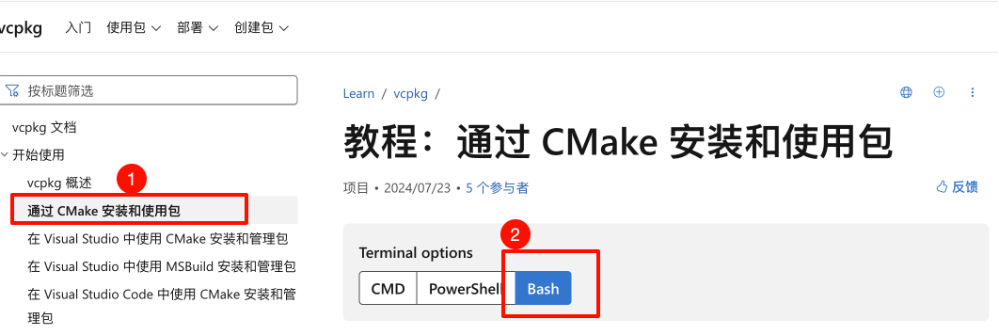

# 备忘录-vcpkg包管理工具
> vcpkg是微软开源的C++包管理工具，可以帮助我们快速安装、编译和管理第三方库。


<!-- @import "[TOC]" {cmd="toc" depthFrom=2 depthTo=6 orderedList=false} -->

<!-- code_chunk_output -->

- [安装vcpkg](#安装vcpkg)
  - [Mac安装](#mac安装)
  - [Windows安装](#windows安装)
- [使用vcpkg](#使用vcpkg)
  - [Mac测试](#mac测试)
- [`vcpkg` 常用命令](#vcpkg-常用命令)

<!-- /code_chunk_output -->


## 安装vcpkg
### Mac安装
1. 登陆官网: https://learn.microsoft.com/zh-cn/vcpkg/get_started/get-started?pivots=shell-bash
2. 找到安装文档
    
    Mac系统选择**Bash**
    
3. 根据后面网页提示，安装vcpkg
    > 下面步骤为24年8月21日记录, 记得看官网是否更新
    1. 下载git仓库
        ```bash
        git clone https://github.com/microsoft/vcpkg.git
        ```
        或国内仓库`git clone https://gitee.com/mirrors/vcpkg.git`
    2. 下载完成后执行文件
        ```bash
        cd vcpkg
       ./bootstrap-vcpkg.sh
        ```
        需要等待一段时间, 若下载不成功看本目录下的**安装部署与备忘录/Cpp/vcpkg软件**下的软件, 将其放到 **/Users/lee/vcpkg** 路径下, 如图
        
    3. 配置环境变量
        ```bash
        vim ~/.zshrc   
        ```
        加入环境变量
        ```
        export VCPKG_ROOT=/Users/lee/vcpkg
        export PATH=$VCPKG_ROOT:$PATH
        ```
        > 注意: `/Users/lee/vcpkg`是vcpkg的安装目录, 请根据实际情况修改. 且这个路径不是上面**vcpkg软件**的路径

        保存并退出, 执行生效环境变量
        ```bash
        source ~/.zshrc
        ```
    4. 检测是否安装成功
        ```bash
        vcpkg --version
        ```
        若输出版本号则安装成功
    5. 总结
        

    6. 可以去后面章节看测试文档

### Windows安装
1. 登陆官网: https://learn.microsoft.com/zh-cn/vcpkg/get_started/get-started?pivots=shell-bash
2. 找到安装文档
    
    Windows系统选择**PowerShell**
    
3. 根据后面网页提示，安装vcpkg

vcpkg的安装方式有两种：

1. 通过vcpkg的安装脚本：

```
./vcpkg install <package>
```

2. 通过vcpkg的安装程序：

1. 下载vcpkg安装程序：  
https://github.com/microsoft/vcpkg/releases/latest

2. 解压vcpkg安装程序到任意目录，如`~/vcpkg`  

3. 打开终端，切换到vcpkg安装目录，执行以下命令：

```
./bootstrap-vcpkg.sh
```      

## 使用vcpkg  
### Mac测试
> 假设我们要引入 `<fmt>` 库
1. 创建项目目录
    ```bash
    mkdir helloworld && cd helloworld
    ```
    此时目录结构如下
    ```
    helloworld
    ```
2. 运行 `vcpkg new` 命令，在项目的目录中创建清单文件
    ```bash
    vcpkg new --application
    ```
    此时目录结构如下
    ```
    helloworld
    ├── vcpkg-configuration.json	
    └── vcpkg.json
    ```
    其中文件`vcpkg.json`内容是空的:
    ```json
    {}
    ```

3. 添加 fmt 依赖项
    ```bash
    vcpkg add port fmt
    ```
    此时目录结构不变, `vcpkg.json`内容如下:
    ```json
    {
        "dependencies": [
            "fmt"
        ]
    }
    ```

4. 创建`CMakeLists.txt`
    
    ```cmake
    cmake_minimum_required(VERSION 3.10)

    project(HelloWorld)

    find_package(fmt CONFIG REQUIRED)

    add_executable(HelloWorld main.cpp)

    target_link_libraries(HelloWorld PRIVATE fmt::fmt)
    ```
    CMakeLists.txt 文件中每一行的作用：
    + `cmake_minimum_required(VERSION 3.10)`：指定生成项目所需的 CMake 最低版本为 `3.10`。 如果系统上安装的 CMake 版本低于此版本，则将生成错误。
    + `project(HelloWorld)`：将项目的名称设置为 "HelloWorld."。
    find_package(fmt CONFIG REQUIRED)：使用 fmt 库的 CMake 配置文件查找该库。 REQUIRED 关键字确保在找不到包时生成错误。
    + `add_executable(HelloWorld main.cpp)`：添加从源文件 main.cpp 生成的名为 "HelloWorld," 的可执行目标。
    + `target_link_libraries(HelloWorld PRIVATE fmt::fmt)`：指定 HelloWorld 可执行文件应链接到 fmt 库。 PRIVATE 关键字表明 fmt 仅在生成 HelloWorld 时需要，不应传播到其他依赖项目。

    此时目录结构如下
    ```
    helloworld
    ├── vcpkg-configuration.json	
    ├── vcpkg.json
    └── CMakeLists.txt
    ```

5. 创建`main.cpp`文件
    ```cpp
    #include <fmt/core.h>

    int main()
    {
        fmt::print("Hello World!\n");
        return 0;
    }
    ```
    此时目录结构如下
    ```
    helloworld
    ├── vcpkg-configuration.json	
    ├── vcpkg.json
    ├── CMakeLists.txt
    └── main.cpp
    ```

6. Cmake编译
    + 创建一个 `CMakePresets.json` 文件，内容如下：
        ```json
        {
            "version": 2,
            "configurePresets": [
                {
                "name": "default",
                "generator": "Ninja",
                "binaryDir": "${sourceDir}/build",
                "cacheVariables": {
                    "CMAKE_TOOLCHAIN_FILE": "$env{VCPKG_ROOT}/scripts/buildsystems/vcpkg.cmake"
                }
                }
            ]
        }
        ```
        此 `CMakePresets.json` 文件包含适用于 CMake 的单个“默认”预设并设置 `CMAKE_TOOLCHAIN_FILE` 变量。 `CMAKE_TOOLCHAIN_FILE` 使 CMake 项目系统能够识别 vcpkg 提供的 C++ 库。 添加 `CMakePresets.json` 将自动执行运行 CMake 时指定工具链的过程。
        此时目录结构如下
        ```
        helloworld
        ├── vcpkg-configuration.json	
        ├── vcpkg.json
        ├── CMakeLists.txt
        ├── main.cpp
        └── CMakePresets.json
        ```
    + 使用 CMake 配置生成
        运行生成构建目录。
        ```bash
        cmake --preset=default
        ```
        > 若运行发现`ninja`有问题, 运行安装`brew install ninja`  
        
        > 若运行时间长, 更换科学上网链接


        此时目录结构如下
        ```
        helloworld
        └──build\
            ├── CMakeCache.txt			
            ├── cmake_install.cmake
            ├── CMakeFiles			
            ├── vcpkg-manifest-install.log
            ├── build.ninja			
            └── vcpkg_installed
        ├── vcpkg-configuration.json	
        ├── vcpkg.json
        ├── CMakeLists.txt
        ├── main.cpp
        └── CMakePresets.json
        ```
    + 运行命令，编译项目。
        ```bash
        cmake --build build
        ```
        此时目录结构如下
        ```
        helloworld
        └──build\
            ├── CMakeCache.txt			
            ├── cmake_install.cmake
            ├── CMakeFiles			
            ├── vcpkg-manifest-install.log
            ├── build.ninja			
            ├── vcpkg_installed
            └── HelloWorld
        ├── vcpkg-configuration.json	
        ├── vcpkg.json
        ├── CMakeLists.txt
        ├── main.cpp
        └── CMakePresets.json
        ```
    + 运行命令，运行程序
        ```bash
        ./build/HelloWorld
        ``` 
        输出结果：
        ```
        Hello World!
        ```
        说明编译成功。


## `vcpkg` 常用命令

+ `vcpkg search <package>`：搜索包。
+ `vcpkg install <package>`：安装包。
+ `vcpkg remove <package>`：卸载包。
+ `vcpkg update`：更新 vcpkg 到最新版本。
+ `vcpkg upgrade`：升级所有已安装的包。
+ `vcpkg list`：列出已安装的包。
+ `vcpkg edit <package>`：编辑包的配置文件。
+ `vcpkg integrate install`：将 vcpkg 集成到 Visual Studio 中。
+ `vcpkg integrate remove`：从 Visual Studio 中移除 vcpkg 的集成。
+ `vcpkg help`：显示帮助信息。