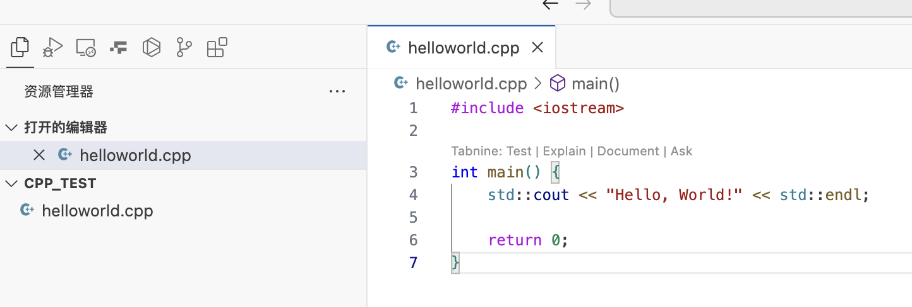
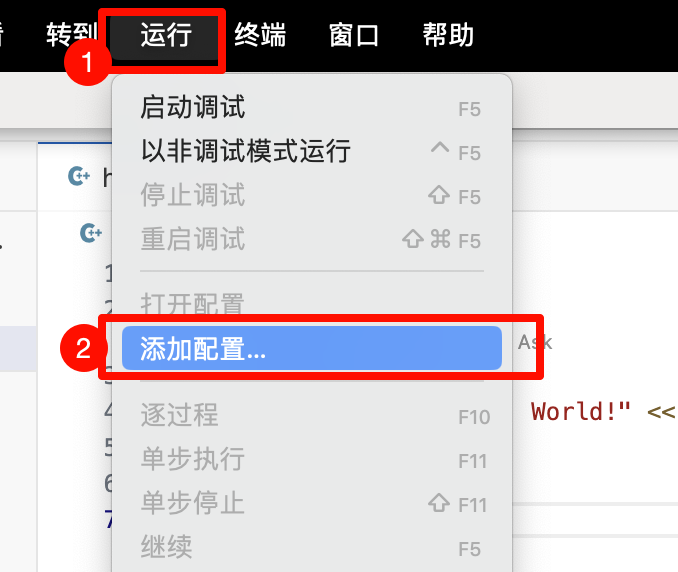
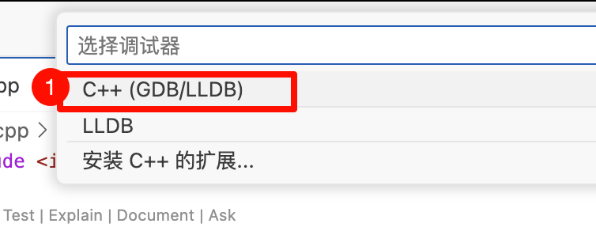
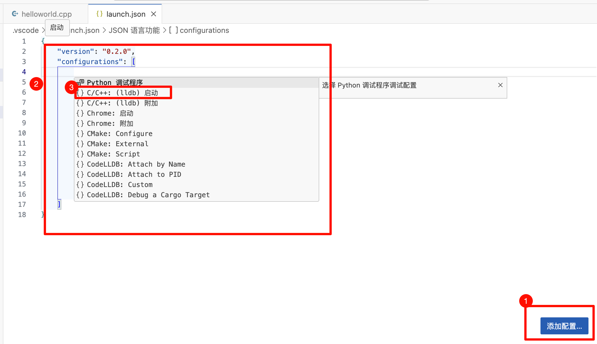
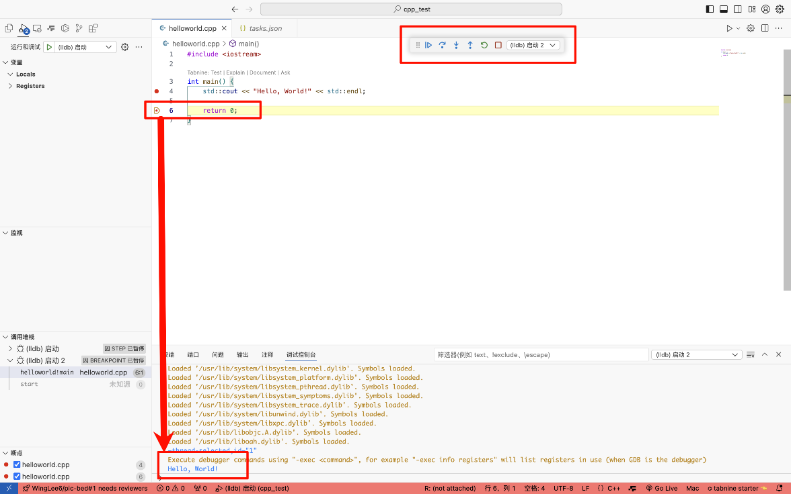
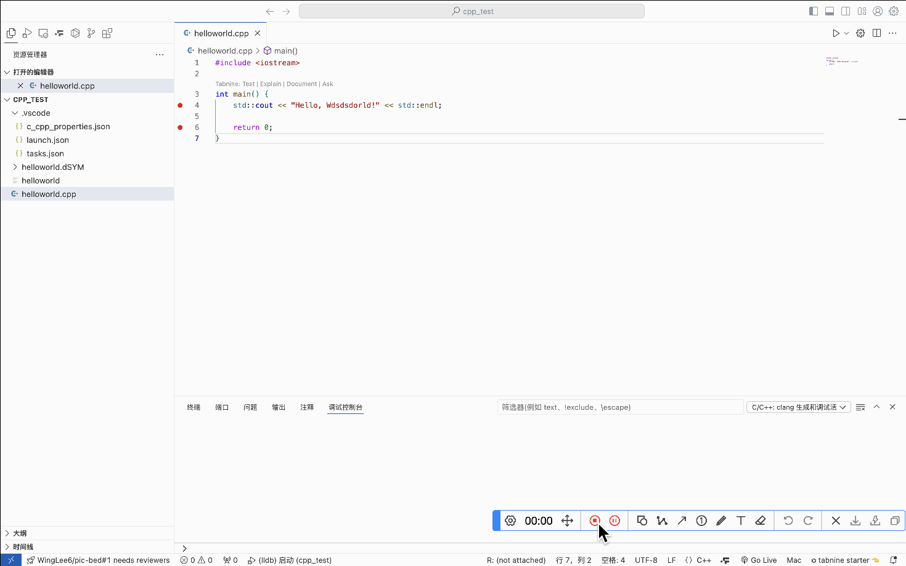

# 安装部署-安装cpp环境及vscode运行

<!-- @import "[TOC]" {cmd="toc" depthFrom=2 depthTo=6 orderedList=false} -->

<!-- code_chunk_output -->

- [基础知识](#基础知识)
  - [1. 配置文件说明:](#1-配置文件说明)
  - [2. C++ 编译器](#2-c-编译器)
    - [2.1 Clang](#21-clang)
    - [2.2 GCC](#22-gcc)
    - [2.3 MSVC](#23-msvc)
- [Mac安装与配置](#mac安装与配置)
  - [1. 安装Xcode(可省略)](#1-安装xcode可省略)
  - [2. 安装 Xcode Command Line Tools](#2-安装-xcode-command-line-tools)
  - [3. 打开vscode](#3-打开vscode)
    - [3.1 安装插件](#31-安装插件)
  - [3.2 配置文件安装](#32-配置文件安装)
    - [法1: 新手配置文件设置](#法1-新手配置文件设置)
    - [法2: 直接用**\.vscode**目录模板](#法2-直接用vscode目录模板)
      - [配置文件模板1: Mac m2 + gcc编译器](#配置文件模板1-mac-m2--gcc编译器)

<!-- /code_chunk_output -->

## 基础知识
### 1. 配置文件说明:
项目目录下有目录`.vscode`, 里面有三个配置文件:
> 根据后文**法1**自动生成, 或**法2**手动创建
+ `tasks.json`: 
    编译任务配置 (compiler build settings)
+ `launch.json`: 
    调试任务配置 (debugger settings)
+ `c_cpp_properties.json`: 
    编译器设置 (compiler path and IntelliSense settings)

### 2. C++ 编译器
C++编译器中的Clang、GCC和MSVC（Microsoft Visual C++）各有其独特的特点和适用场景，以下是它们之间的主要区别：

#### 2.1 Clang

**特点**：

* **开源与模块化**：Clang是LLVM（Low Level Virtual Machine）项目的一部分，是一个开源的C、C++、Objective-C和Objective-C++编译器前端。其设计模块化，易于扩展和维护。
* **高性能**：Clang提供了快速的编译速度和优秀的优化能力，可以显著减少构建时间。
* **准确的错误诊断**：Clang提供了详细的错误信息和诊断，有助于开发者快速定位和修复问题。
* **跨平台支持**：Clang支持多种操作系统和架构，包括macOS、Linux、Windows等。
* **静态分析**：Clang支持静态代码分析，有助于在编译阶段发现潜在的错误和安全问题。

**适用场景**：

* 需要快速编译和高性能优化的项目。
* 跨平台开发，希望代码能在多个操作系统上编译运行。
* 对代码质量和安全性有较高要求的项目。

#### 2.2 GCC

**特点**：

* **开源与广泛支持**：GCC（GNU Compiler Collection）是一个广泛使用的开源编译器套件，支持多种编程语言，包括C、C++等。它是C++标准的参考实现之一。
* **跨平台**：GCC能在多种操作系统上运行，如Linux、Unix以及Windows（通过MinGW或TDM-GCC等移植版本）。
* **优化选项丰富**：GCC提供了丰富的优化选项，可以根据不同的编译需求进行代码优化。
* **社区支持强大**：GCC在开源社区中得到了广泛的支持和贡献，拥有庞大的用户群体和丰富的文档资源。

**适用场景**：

* 需要高度可移植性和性能优化的项目。
* 希望在Linux或Unix系统上开发C++应用程序的项目。
* 寻求稳定且功能丰富的编译器选项的项目。

#### 2.3 MSVC

**特点**：

* **集成开发环境**：MSVC是Microsoft Visual Studio集成开发环境的一部分，提供了强大的IDE支持，包括代码编辑、编译、调试和运行等功能。
* **Windows API支持**：MSVC与Windows平台紧密集成，提供了丰富的Windows API支持，便于开发Windows桌面应用程序。
* **性能分析工具**：MSVC内置了性能分析工具，有助于开发者优化代码性能，减少资源消耗。
* **商业许可**：MSVC是商业软件，需要购买许可才能使用。

**适用场景**：

* 开发Windows桌面应用程序的项目。
* 需要与Visual Studio集成开发环境紧密配合的项目。
* 对Windows平台特定功能和库有高度依赖的项目。


## Mac安装与配置
### 1. 安装Xcode(可省略)
在App Store中搜索Xcode并安装

### 2. 安装 Xcode Command Line Tools
终端安装:
```bash
xcode-select --install
```
验证是否安装成功:
```bash
clang -v
```
> 或`clang --version`  

返回下面类似内容表示安装成功:
```
> clang -v          
Apple clang version 15.0.0 (clang-1500.3.9.4)
Target: arm64-apple-darwin23.5.0
Thread model: posix
InstalledDir: /Applications/Xcode.app/Contents/Developer/Toolchains/XcodeDefault.xctoolchain/usr/bin
```


### 3. 打开vscode

1. 官方文档1: [官方安装文档](https://code.visualstudio.com/docs/cpp/config-clang-mac)
2. 官方文档2: [配置参数说明](https://code.visualstudio.com/docs/editor/variables-reference)

#### 3.1 安装插件
+ **C/C++**: 编辑、调试C/C++程序
+ **CodeLLDB**: Mac下一定要安装这个插件，用来debug，解决Catalina不支持lldb调试问题
+ **code runner**: 用来编译
+ **C/C++ Extension Pack**: VScode推荐安装
    
    
### 3.2 配置文件安装
配置文件说明:
项目目录下有目录`.vscode`, 里面有三个配置文件:
> 根据后文**法1**自动生成, 或**法2**手动创建
+ `tasks.json`: 
    编译任务配置 (compiler build settings)
+ `launch.json`: 
    调试任务配置 (debugger settings)
+ `c_cpp_properties.json`: 
    编译器设置 (compiler path and IntelliSense settings)

#### 法1: 新手配置文件设置
0. 配置选项官方说明, 见[配置参数说明](https://code.visualstudio.com/docs/editor/variables-reference)
    部分简述:
    ```
    ${userHome} - the path of the user's home folder
    ${workspaceFolder} - the path of the folder opened in VS Code
    ${workspaceFolderBasename} - the name of the folder opened in VS Code without any slashes (/)
    ${file} - the current opened file
    ${fileWorkspaceFolder} - the current opened file's workspace folder
    ${relativeFile} - the current opened file relative to workspaceFolder
    ${relativeFileDirname} - the current opened file's dirname relative to workspaceFolder
    ${fileBasename} - the current opened file's basename
    ${fileBasenameNoExtension} - the current opened file's basename with no file extension
    ${fileExtname} - the current opened file's extension
    ${fileDirname} - the current opened file's folder path
    ${fileDirnameBasename} - the current opened file's folder name
    ${cwd} - the task runner's current working directory upon the startup of VS Code
    ${lineNumber} - the current selected line number in the active file
    ${selectedText} - the current selected text in the active file
    ${execPath} - the path to the running VS Code executable
    ${defaultBuildTask} - the name of the default build task
    ${pathSeparator} - the character used by the operating system to separate components in file paths
    ${/} - shorthand for ${pathSeparator}
    ```


1. 创建一个新文件夹, 在VScode打开并创建CPP程序 `helloworld.cpp`
     

    代码如下:
    ```cpp
    #include <iostream>   
    
    int main() {    
        std::cout << "Hello, World!" << std::endl;  
        
        return 0;  
    }
    ```

2. 创建`tasks.json`文件
    + 在VS Code的菜单项选择`Terminal` --> `Configure Tasks`
        
    + 点击`C/C++: g++ build active file`
        
    + 会自动生产`.vscode/tasks.json`文件, 内容如下:
        
        ```json
        {
            "version": "2.0.0",
            "tasks": [
                {
                    "type": "cppbuild",
                    "label": "C/C++: g++ 生成活动文件",
                    "command": "/usr/bin/g++",
                    "args": [
                        "-fdiagnostics-color=always",
                        "-g",
                        "${file}",
                        "-o",
                        "${fileDirname}/${fileBasenameNoExtension}"
                    ],
                    "options": {
                        "cwd": "${fileDirname}"
                    },
                    "problemMatcher": [
                        "$gcc"
                    ],
                    "group": "build",
                    "detail": "编译器: /usr/bin/g++"
                }
            ]
        }
        ```
    + 配置完成后，可以选择 `Terminal` --> `Run Build Task` 来编译源文件，生成可执行文件
        
        会自动生产目录 **helloworld.dSYM** 和 可执行exe文件 **helloworld**
        

3. 创建`launch.json`文件
    + (保持helloworld.cpp文件打开) 在VS Code的菜单项选择`Run` --> `Add Configuration...`
        
    + 选择 `C++(GDB/LLDB)`
        
        稍等片刻，会自动生成`.vscode/launch.json`文件, 内容如下:
        
        点击 ① 按钮，会弹出 ② 选项卡, 选择 ③ **C/C++:（lldb）启动**, 自动生成配置模板. 可修改内容为:
        > 模板参数要改成: `"program": "${fileDirname}/${fileBasenameNoExtension}",`
        ```json
        {
            // 使用 IntelliSense 了解相关属性。 
            // 悬停以查看现有属性的描述。
            // 欲了解更多信息，请访问: https://go.microsoft.com/fwlink/?linkid=830387
            "version": "0.2.0",
            "configurations": [
                {
                    "name": "(lldb) 启动",
                    "type": "cppdbg",
                    "request": "launch",
                    "program": "${fileDirname}/${fileBasenameNoExtension}",
                    "args": [],
                    "stopAtEntry": false,
                    "cwd": "${fileDirname}",
                    "environment": [],
                    "externalConsole": false,
                    "MIMode": "lldb"
                }

            ]
        }
        ```    
    
    + 调试测试
        可以进行调试测试, 回到c++程序, 在VS Code菜单项选择 **Run --> Start Debugging**, 开始调试
        
        可以设置断点, 然后依次运行, 结果输出在控制台(如下图)
        
4. `c_cpp_properties.json`文件
    快捷命令**command** + **shift** + **p**, 在命令框中输入C/C++，选择**C/C++: Edit Configurations (JSON)**，会自动生成`.vscode/c_cpp_properties.json`文件, 内容如下:
    > 主要修改编译器路径和intelliSenseMode  

    ```json
    {
        "configurations": [
            {
                "name": "Mac",
                "includePath": [
                    "${workspaceFolder}/**"
                ],
                "defines": [],
                "macFrameworkPath": [
                    "/Applications/Xcode.app/Contents/Developer/Platforms/MacOSX.platform/Developer/SDKs/MacOSX.sdk/System/Library/Frameworks"
                ],
                "compilerPath": "/usr/bin/clang",
                "cStandard": "c17",
                "cppStandard": "c++17",
                "intelliSenseMode": "macos-clang-arm64"
            }
        ],
        "version": 4
    }
    ```

5. 编译运行程序
    

#### 法2: 直接用**\.vscode**目录模板
##### 配置文件模板1: Mac m2 + gcc编译器
在项目目录下创建`.vscode`目录, 并在该目录下创建三个配置文件:
目录结构如下:
```
项目目录/
└── .vscode/
    └── tasks.json
    └── launch.json
    └── c_cpp_properties.json
└── 其他文件或目录
```
> 注意: 若已有`.vscode`目录, 则直接复制上述三个配置文件到`.vscode`目录下即可
1. tasks.json
    ```json
    {
        "version": "2.0.0",
        "tasks": [
            {
                "type": "cppbuild",
                "label": "C/C++: g++ 生成活动文件",
                "command": "/usr/bin/g++",
                "args": [
                    "-fdiagnostics-color=always",
                    "-g",
                    "${file}",
                    "-o",
                    "${fileDirname}/${fileBasenameNoExtension}"
                ],
                "options": {
                    "cwd": "${fileDirname}"
                },
                "problemMatcher": [
                    "$gcc"
                ],
                "group": "build",
                "detail": "编译器: /usr/bin/g++"
            }
        ]
    }
    ```
2. launch.json
    ```json
    {
        // 使用 IntelliSense 了解相关属性。 
        // 悬停以查看现有属性的描述。
        // 欲了解更多信息，请访问: https://go.microsoft.com/fwlink/?linkid=830387
        "version": "0.2.0",
        "configurations": [
            {
                "name": "(lldb) 启动",
                "type": "cppdbg",
                "request": "launch",
                "program": "${fileDirname}/${fileBasenameNoExtension}",
                "args": [],
                "stopAtEntry": false,
                "cwd": "${fileDirname}",
                "environment": [],
                "externalConsole": false,
                "MIMode": "lldb"
            }

        ]
    }
    ```

3. c_cpp_properties.json
    ```json
    {
        "configurations": [
            {
                "name": "Mac",
                "includePath": [
                    "${workspaceFolder}/**"
                ],
                "defines": [],
                "macFrameworkPath": [
                    "/Applications/Xcode.app/Contents/Developer/Platforms/MacOSX.platform/Developer/SDKs/MacOSX.sdk/System/Library/Frameworks"
                ],
                "compilerPath": "/usr/bin/clang",
                "cStandard": "c17",
                "cppStandard": "c++17",
                "intelliSenseMode": "macos-clang-arm64"
            }
        ],
        "version": 4
    }
    ```


参考链接:
1. https://www.cnblogs.com/booturbo/p/17389050.html