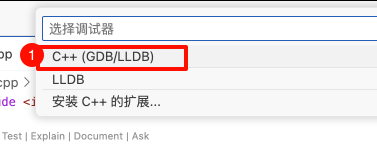
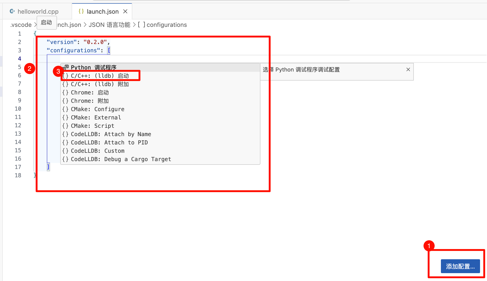

# 安装部署-mac安装cpp环境及vscode运行

<!-- @import "[TOC]" {cmd="toc" depthFrom=2 depthTo=6 orderedList=false} -->

<!-- code_chunk_output -->

- [1. 安装Xcode](#1-安装xcode)
- [2. 安装 Xcode Command Line Tools](#2-安装-xcode-command-line-tools)
- [3. 打开vscode](#3-打开vscode)
  - [3.1 安装插件](#31-安装插件)
  - [3.2 配置文件安装](#32-配置文件安装)
    - [法1: 新手配置文件设置](#法1-新手配置文件设置)

<!-- /code_chunk_output -->


## 1. 安装Xcode
在App Store中搜索Xcode并安装

## 2. 安装 Xcode Command Line Tools
终端安装:
```bash
xcode-select --install
```
验证是否安装成功:
```bash
clang -v
```
> 或`clang --version`  

返回下面类似内容表示安装成功:
```
> clang -v          
Apple clang version 15.0.0 (clang-1500.3.9.4)
Target: arm64-apple-darwin23.5.0
Thread model: posix
InstalledDir: /Applications/Xcode.app/Contents/Developer/Toolchains/XcodeDefault.xctoolchain/usr/bin
```


## 3. 打开vscode

1. 官方文档1: [官方安装文档](https://code.visualstudio.com/docs/cpp/config-clang-mac)
2. 官方文档2: [配置参数说明](https://code.visualstudio.com/docs/editor/variables-reference)

### 3.1 安装插件
+ **C/C++**: 编辑、调试C/C++程序
+ **CodeLLDB**: Mac下一定要安装这个插件，用来debug，解决Catalina不支持lldb调试问题
+ **code runner**: 用来编译
+ **C/C++ Extension Pack**: VScode推荐安装
    
    
### 3.2 配置文件安装
配置文件说明:
项目目录下有目录`.vscode`, 此目录中创建三个配置文件:
+ `tasks.json`: 
    编译任务配置 (compiler build settings)
+ ` launch.json`: 
    调试任务配置 (debugger settings)
+ `c_cpp_properties.json`: 
    编译器设置 (compiler path and IntelliSense settings)

#### 法1: 新手配置文件设置
0. 配置选项官方说明, 见[配置参数说明](https://code.visualstudio.com/docs/editor/variables-reference)
    部分简述:
    ```
    ${userHome} - the path of the user's home folder
    ${workspaceFolder} - the path of the folder opened in VS Code
    ${workspaceFolderBasename} - the name of the folder opened in VS Code without any slashes (/)
    ${file} - the current opened file
    ${fileWorkspaceFolder} - the current opened file's workspace folder
    ${relativeFile} - the current opened file relative to workspaceFolder
    ${relativeFileDirname} - the current opened file's dirname relative to workspaceFolder
    ${fileBasename} - the current opened file's basename
    ${fileBasenameNoExtension} - the current opened file's basename with no file extension
    ${fileExtname} - the current opened file's extension
    ${fileDirname} - the current opened file's folder path
    ${fileDirnameBasename} - the current opened file's folder name
    ${cwd} - the task runner's current working directory upon the startup of VS Code
    ${lineNumber} - the current selected line number in the active file
    ${selectedText} - the current selected text in the active file
    ${execPath} - the path to the running VS Code executable
    ${defaultBuildTask} - the name of the default build task
    ${pathSeparator} - the character used by the operating system to separate components in file paths
    ${/} - shorthand for ${pathSeparator}
    ```


1. 创建一个新文件夹, 在VScode打开并创建CPP程序 `helloworld.cpp`
     

    代码如下:
    ```cpp
    #include <iostream>   
    
    int main() {    
        std::cout << "Hello, World!" << std::endl;  
        
        return 0;  
    }
    ```

2. 创建`tasks.json`文件
    + 在VS Code的菜单项选择`Terminal` --> `Configure Tasks`
        
    + 点击`C/C++: g++ build active file`
        
    + 会自动生产`.vscode/tasks.json`文件, 内容如下:
        
        ```json
        {
            "version": "2.0.0",
            "tasks": [
                {
                    "type": "cppbuild",
                    "label": "C/C++: g++ 生成活动文件",
                    "command": "/usr/bin/g++",
                    "args": [
                        "-fdiagnostics-color=always",
                        "-g",
                        "${file}",
                        "-o",
                        "${fileDirname}/${fileBasenameNoExtension}"
                    ],
                    "options": {
                        "cwd": "${fileDirname}"
                    },
                    "problemMatcher": [
                        "$gcc"
                    ],
                    "group": "build",
                    "detail": "编译器: /usr/bin/g++"
                }
            ]
        }
        ```
    + 配置完成后，可以选择 `Terminal` --> `Run Build Task` 来编译源文件，生成可执行文件
        
        会自动生产目录 **helloworld.dSYM** 和 可执行exe文件 **helloworld**
        

3. 创建`launch.json`文件
    + (保持helloworld.cpp文件打开) 在VS Code的菜单项选择`Run` --> `Add Configuration...`
        
    + 选择 `C++(GDB/LLDB)`
        
        稍等片刻，会自动生成`.vscode/launch.json`文件, 内容如下:
        
        点击 ① 按钮，会弹出 ② 选项卡, 选择 ③ **C/C++:（lldb）启动**, 自动生成配置模板. 可修改内容为:
        ```json
        {
            "version": "0.2.0",
            "configurations": [
                {
                    "name": "(lldb) 启动",
                    "type": "cppdbg",
                    "request": "launch",
                    "program": "${fileDirname}/${fileBasenameNoExtension}",
                    "args": [],
                    "stopAtEntry": false,
                    "cwd": "${fileDirname}",
                    "environment": [],
                    "externalConsole": false,
                    "MIMode": "lldb"
                }
            ]
        }
        ```    
    
4. 创建`c_cpp_properties.json`文件

5. 编译运行程序


参考链接:
1. https://www.cnblogs.com/booturbo/p/17389050.html