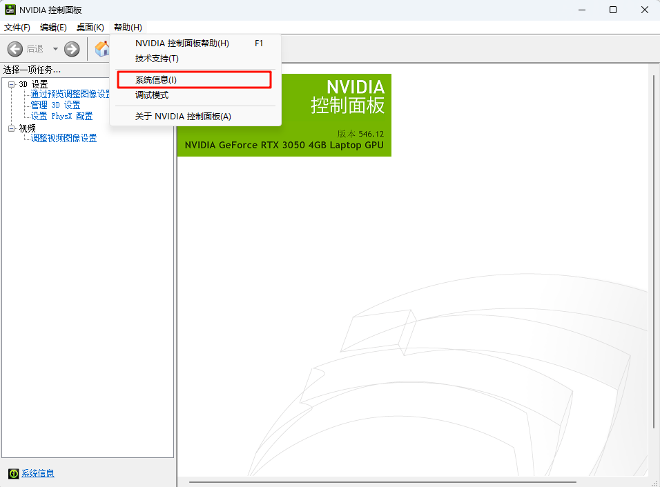
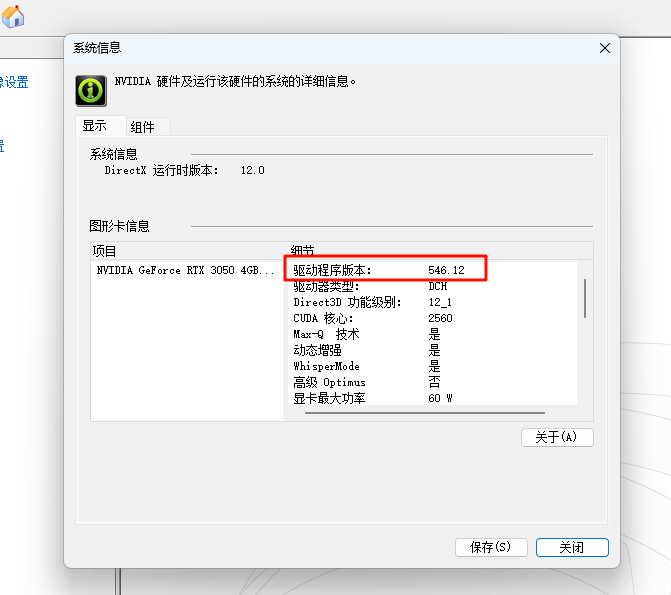
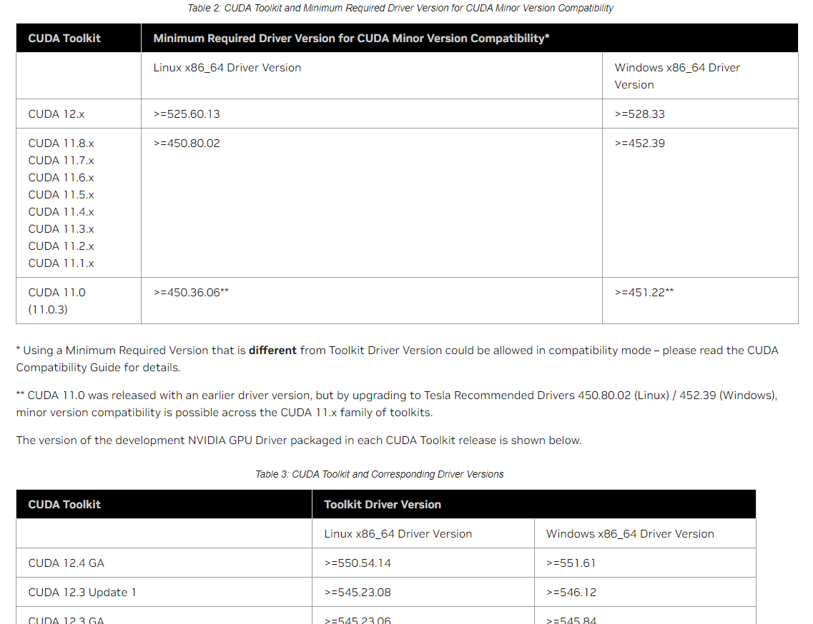
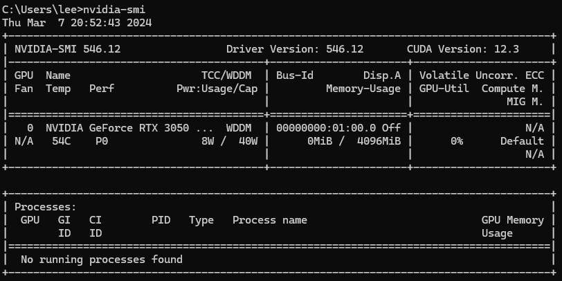
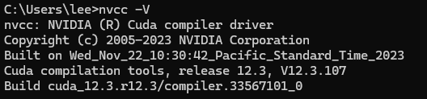

# 安装配置 - Cuda安装与使用


## 一. Cuda安装教程
> 参考视频: 【Windows 下安装 CUDA 和 Pytorch 跑深度学习 - 动手学深度学习v2】 https://www.bilibili.com/video/BV18K411w7Vs/?share_source=copy_web&vd_source=f07a36b3829106945a5ec1377ecea116


1. 访问官网
    地址[Cuda官网](https://developer.nvidia.com/cuda-downloads?target_os=Windows&target_arch=x86_64&target_version=11&target_type=exe_local)
    > 此处已选择相关参数, 可以点击下载即可

    下载后得到文件`cuda_12.3.2_546.12_windows.exe`, 此处版本为12.3.2. 
    
    + 查询电脑支持安装哪些版本的Cuda
        1. 打开自己的NVIDIA 控制面板
            一般电脑右下角都有. 如果找不到，可以在搜索中搜索`NVIDIA Control Panel`. 
            
        2. 选择顶部选项卡的"帮助"
            下拉选项中找到的"系统信息"
            
            弹出框中找到"驱动程序版本"信息(如下图红框版本为546.12, 即显卡驱动版本)
            
            
        3. 官网查询
            访问https://docs.nvidia.com/cuda/cuda-toolkit-release-notes/index.html#id5
            找到如图
            
            
2. 安装
    打开程序`cuda_12.3.2_546.12_windows.exe`即可安装

3. 检验是否安装成功
    在终端输入命令行
    ```ssh
    nvidia-smi
    ```
    得到输出结果
    
    可以看到此电脑安装的版本是12.3
    或使用命令行
    ```ssh
    nvcc -V
    ```
    