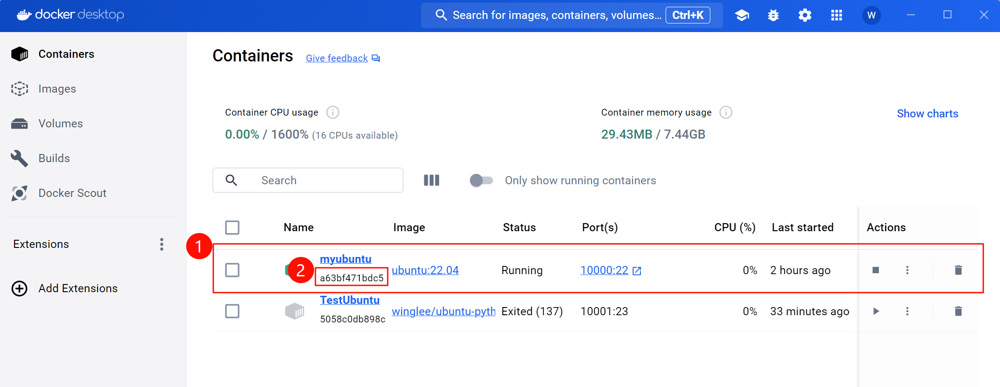

# 备忘录 - 将设置好的镜像制备
> 参考 [Docker 镜像制作教程](https://www.bilibili.com/video/BV1v5411G7xc/?share_source=copy_web&vd_source=f07a36b3829106945a5ec1377ecea116)
## 〇. 准备工作

这个运行实例已经安装好python等环境
- 记住2号红框中的编号

## 一. 制备镜像
```shell
docker commit 2 镜像名:版本号
```
- 2号红框中的编号是容器的编号，镜像名和版本号可以自定义
如
```shell
docker commit a63 winglee/ubuntu-python3.10:0.1
```

## 二. 运行镜像
```shell
docker run -it 镜像名:版本号 /bin/bash
```


