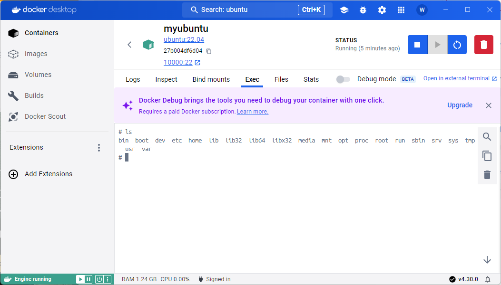

# 安装部署-Docker安装

<!-- @import "[TOC]" {cmd="toc" depthFrom=2 depthTo=6 orderedList=false} -->

<!-- code_chunk_output -->

- [一. 安装Docker Desktop](#一-安装docker-desktop)
  - [1.1 下载软件](#11-下载软件)
  - [1.2 检查Docker是否安装成功 - 运行`hello world`镜像](#12-检查docker是否安装成功---运行hello-world镜像)
- [二. 示例: 运行Ubuntu](#二-示例-运行ubuntu)

<!-- /code_chunk_output -->


1. 官方文档： https://docs.docker.com/manuals/
## 一. 安装Docker Desktop
### 1.1 下载软件
1. 登陆官网       
[Install Docker Desktop on Windows](https://docs.docker.com/desktop/install/windows-install/)

找到合适的版本, 一般图中红框版本, 点击下载, 下载好后双击运行安装.

### 1.2 检查Docker是否安装成功 - 运行`hello world`镜像
打开终端(`win+R`, 输入`cmd`), 命令行运行
```bash
docker run hello-world
```
结果如图运行, 则表示**Docker Desktop**安装成功


## 二. 示例: 运行Ubuntu
1. 拉取Ubuntu镜像
    1. 找到Docker的Ubuntu镜像
        打开软件**Docker Desktop**, 在顶部搜索栏搜索Ubuntu, 如图  
        
        + 绿色勋章, 为**docker**官方镜像
        + **Tag**可以选择版本
            - 可选`latest`或者`24.04`
        + **Pull**拉取该镜像
        + **Run**运行该镜像
    2. 拉取镜像
        点击**Pull**, 然后退出, 在打开软件的**Image**选项卡, 将看到已经被`Pull`到本地的镜像
        
        > 这里**Pull**两个版本的Ubuntu镜像  

    **上述操作可通过命令行实现**:
    1. 拉取镜像
        ```bash
        docker pull ubuntu:22.04
        ```
        + 通过`docker pull XXX`实现
            > 或`docker pull ubuntu`则拉取默认版本`latest`
        + `22.04`为其中一个版本, 可换成其他版本
    2. 查看当前本地镜像
        ```bash
        docker images
        ```
        
        
    

2. 运行**Ubuntu**镜像  
    在**Docker Desktop**软件的**Image**选项卡, 将看到已经被`Pull`到本地的镜像
    
    打开终端, 输入:
    ```
    docker run -itd -p 0.0.0.0:10000:22 --name myubuntu ubuntu:22.04 /bin/bash
    ```
    > 完整命令`docker run -itd -p IP地址:外部端口:内部端口 --name 容器名字 镜像:标签 /bin/bash`
    + `0.0.0.0`表示本地所有的IP
    + 外部端口是指Windows操作系统中的端口
        - `10000`表示把windows系统中的`10000`端口映射到了ubuntu的`22`端口(ssh需要使用22端口)
        
    + 内部端口是指容器中的Ubuntu操作系统的端口
    + `--name XXX` 是容器名称, 此处设置为`myubuntu`

3. 查看已运行容器
    可以用命令查看
    ```bash
    docker ps
    ```
    
    
    或, 通过**Containers**选项卡界面查看
    
    + 黄框中正方形表示正在运行, 若为三角形播放键则表示容器已经停止

4. 进入Ubuntu  
    点击**Open in Terminal**
    
    进入后命令行界面如图所示
    

5. 设置Ubuntu
    > [参考](https://blog.csdn.net/qq_44667259/article/details/129867255)
    ```bash
    apt update
    ```
    ```bash
    apt install openssh-server
    ```
    
    ```bash
    apt install vim
    ```
    
    ```bash
    cd /etc/ssh
    vim sshd_config
    ```
    配置
    ```
    PermitRootLogin yes #允许root使用ssh登录
    
    PubkeyAuthentication yes #启用公钥私钥配对认证方式
    
    AuthorizedKeysFile .ssh/authorized_keys .ssh/authorized_keys2 # AuthorizedKeysFile项已包含在配置文件，这里只需要取消注释即可，此处的路径“.ssh/authorized_keys”以本地文件为准
    
    UsePAM no #不适用PAM
    ```
    
    ```bash
    service ssh start
 
    service ssh status
    ```
    
    ```bash
    passwd
    ```