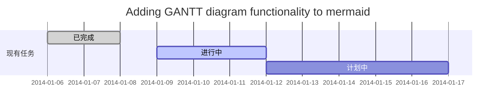
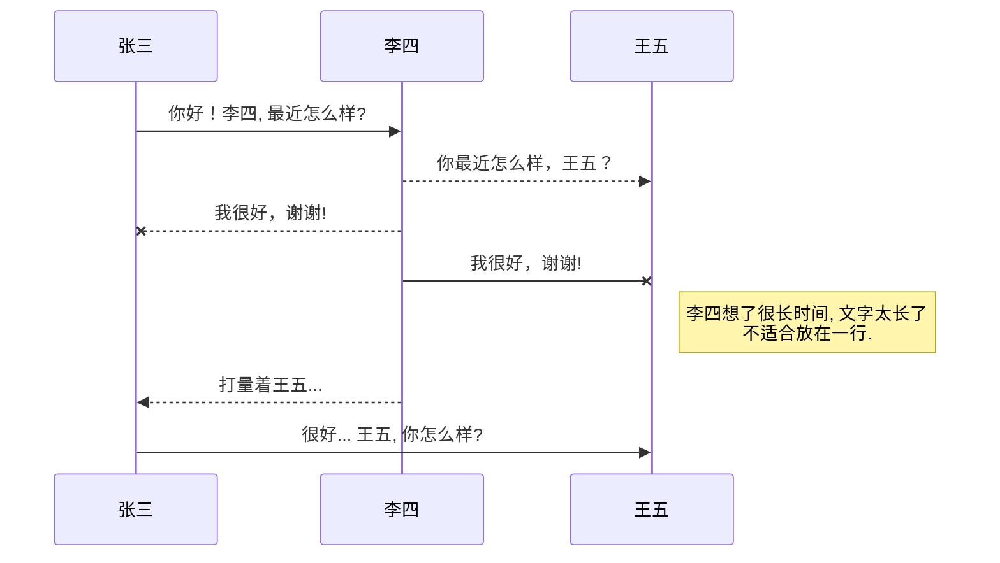
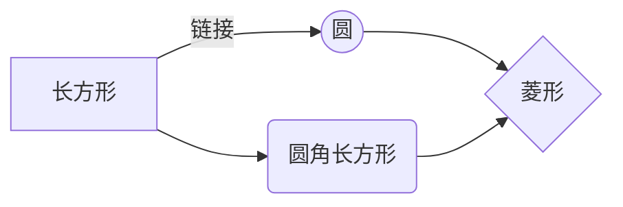
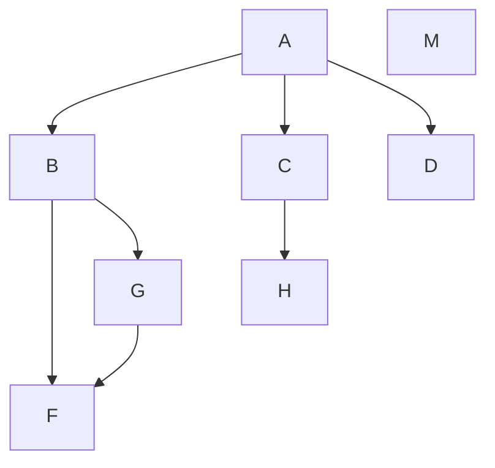
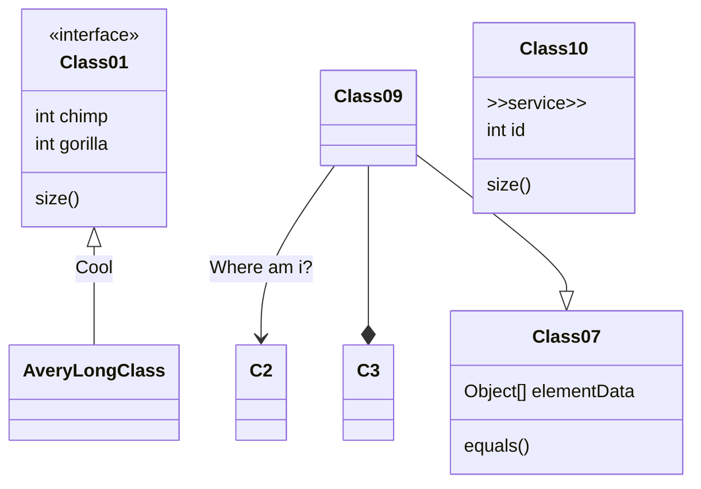

# Markdown语法

<!-- @import "[TOC]" {cmd="toc" depthFrom=1 depthTo=6 orderedList=false} -->

<!-- code_chunk_output -->

- [Markdown语法](#-markdown语法)
  - [标题](#-标题)
  - [文本样式](#-文本样式)
  - [列表](#-列表)
  - [图片](#-图片)
    - [图片:](#-图片--)
    - [带尺寸的图片:](#-带尺寸的图片---)
    - [宽度确定高度等比例的图片:](#-宽度确定高度等比例的图片---)
    - [高度确定宽度等比例的图片:](#-高度确定宽度等比例的图片--)
    - [居中的图片:](#-居中的图片---)
    - [居中并且带尺寸的图片:](#-居中并且带尺寸的图片---)
    - [居右的图片:](#-居右的图片---)
  - [链接](#-链接--)
  - [目录](#-目录)
  - [代码片](#-代码片)
  - [表格](#-表格)
  - [注脚](#-注脚)
  - [注释](#-注释)
  - [自定义列表](#-自定义列表)
  - [LaTeX数学公式](#-latex数学公式)
  - [插入甘特图](#-插入甘特图)
  - [插入UML图](#-插入uml图)
  - [插入Mermaid流程图](#-插入mermaid流程图)
  - [插入Flowchart流程图](#-插入flowchart流程图)
  - [插入类图](#-插入类图)

<!-- /code_chunk_output -->


## 标题
```
# 一级标题
## 二级标题
### 三级标题
#### 四级标题
##### 五级标题
###### 六级标题
```

## 文本样式
*强调文本* _强调文本_

**加粗文本** __加粗文本__

==标记文本==

~~删除文本~~

> 引用文本

H~2~O is是液体。

2^10^ 运算结果是 1024。


## 列表
- 项目
  * 项目
    + 项目

1. 项目1
2. 项目2
3. 项目3

- [ ] 计划任务
- [x] 完成任务


## 图片
### 图片:  
 

### 带尺寸的图片:   


### 宽度确定高度等比例的图片:   


### 高度确定宽度等比例的图片:  
 

### 居中的图片:   


### 居中并且带尺寸的图片:   


### 居右的图片:   


## 链接  
链接: [link](https://www.csdn.net/)


## 目录
```
@[TOC](这里写目录标题)
# 一级目录
## 二级目录
### 三级目录
```

## 代码片
下面展示一些 `内联代码片`。

```
// A code block
var foo = 'bar';
```

```javascript
// An highlighted block
var foo = 'bar';
```


## 表格
项目     | Value
-------- | -----
电脑  | $1600
手机  | $12
导管  | $1

| Column 1 | Column 2      |
|:--------:| :-------------|
| centered 文本居中 | right-aligned 文本居左 |
| centered 文本居中 | <li>元素1</li> <li>元素2</li> |
| centered 文本居中 | <ol> <li>元素1</li> <li>元素2</li> </ol> |


## 注脚

一个具有注脚的文本。[^1]

[^1]: 注脚的解释

## 注释
Markdown将文本转换为 HTML。

*[HTML]:   超文本标记语言


## 自定义列表
Markdown
:  Text-to-HTML conversion tool

Authors
:  John
:  Luke

## LaTeX数学公式
Gamma公式展示 $\Gamma(n) = (n-1)!\quad\forall
n\in\mathbb N$ 是通过 Euler integral

$$
\Gamma(z) = \int_0^\infty t^{z-1}e^{-t}dt\,.
$$


## 插入甘特图


## 插入UML图


## 插入Mermaid流程图



## 插入Flowchart流程图


## 插入类图
