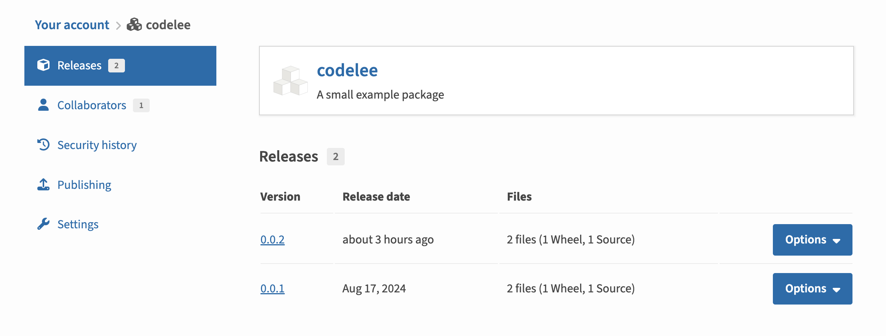

# 备忘录 - Pypi发布库
> 参考: https://packaging.python.org/en/latest/tutorials/packaging-projects/

## 1. 注册Pypi账号
> 
首先需要注册Pypi账号，访问[Pypi官网](https://pypi.org/)，点击右上角的注册按钮，填写相关信息即可。

## 2. 安装twine

## z. 发布新版本之后, 进行包管理

