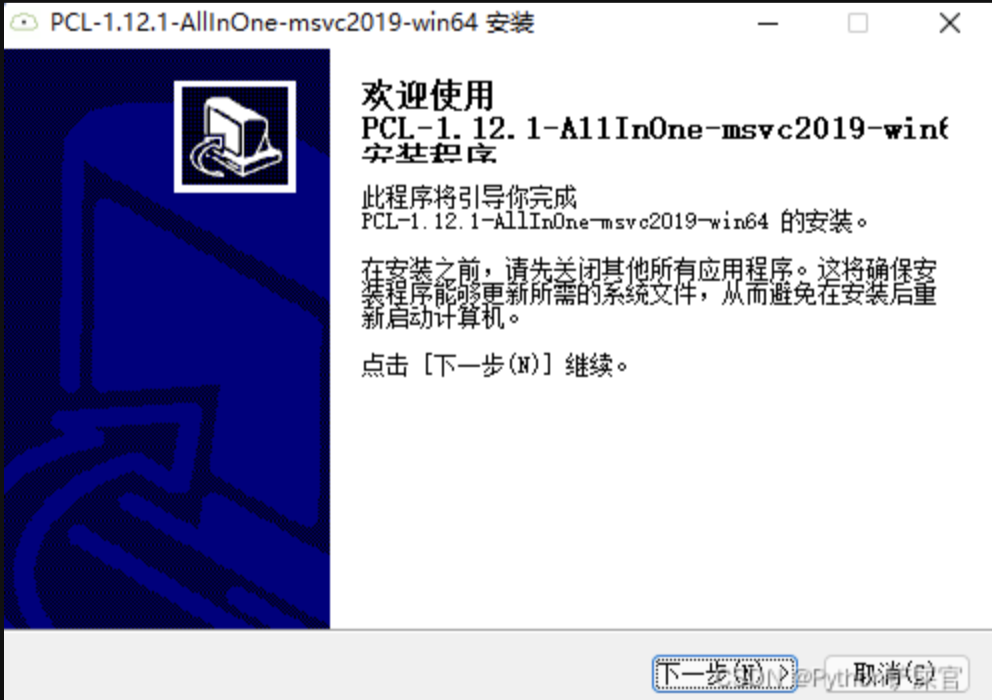
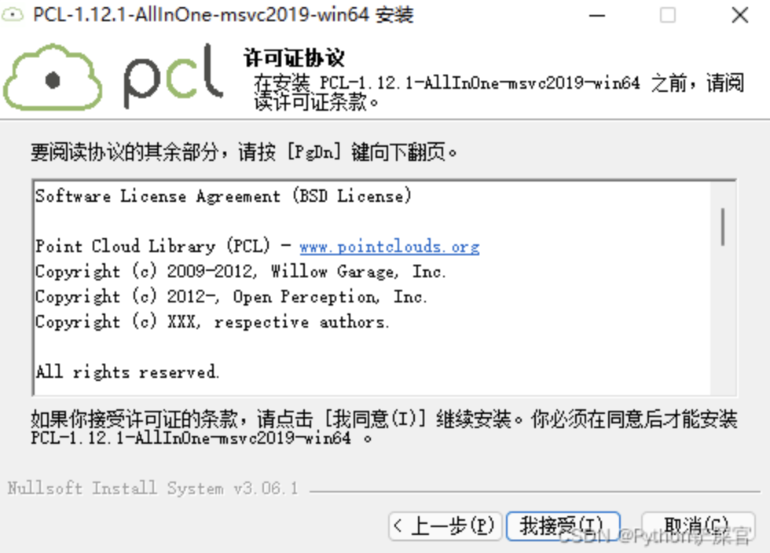
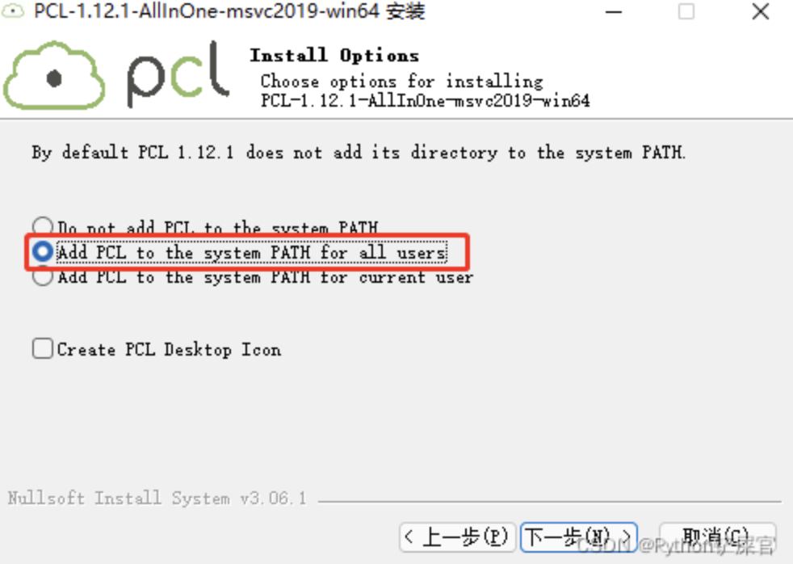
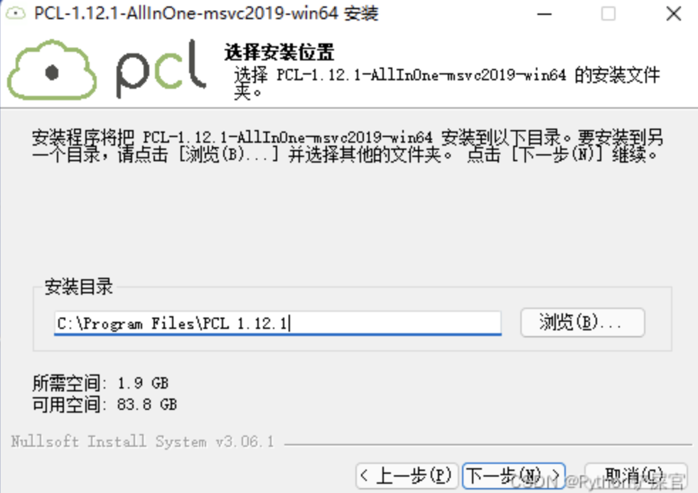
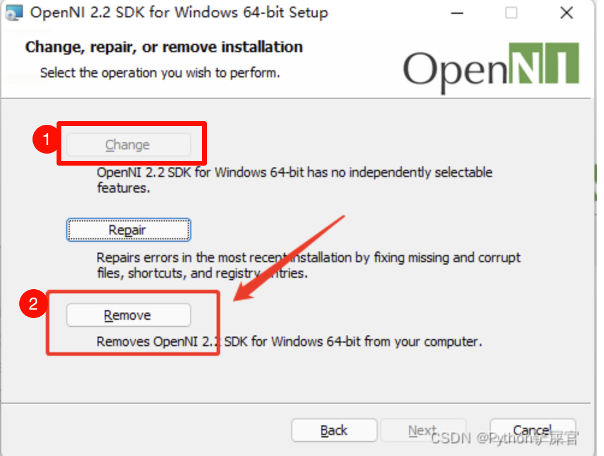

# 安装部署 - python 3.6 安装PCL

<!-- @import "[TOC]" {cmd="toc" depthFrom=2 depthTo=6 orderedList=false} -->

<!-- code_chunk_output -->

- [Mac安装pcl环境](#mac安装pcl环境)
  - [1. 创建conda环境](#1-创建conda环境)
  - [2. 安装pcl](#2-安装pcl)
  - [3. 验证pcl安装成功](#3-验证pcl安装成功)
- [Window11 安装pcl环境](#window11-安装pcl环境)
  - [1. 创建conda环境](#1-创建conda环境-1)
  - [2. 下载软件](#2-下载软件)
  - [3. 运行 PCL-1.12.1-AllInOne-msvc2019-win64.exe](#3-运行-pcl-1121-allinone-msvc2019-win64exe)
  - [4. 放文件到**PCL 1.14.1\bin**](#4-放文件到pcl-1141bin)
  - [5. 运行OpenNI-Windows-x64-2.2.msi](#5-运行openni-windows-x64-22msi)
  - [6. 安装Python-PCL](#6-安装python-pcl)

<!-- /code_chunk_output -->


## Mac安装pcl环境
> 不推荐, python很多没有适配M芯片
### 1. 创建conda环境
- Python版本为3.9
### 2. 安装pcl
命令行安装:
```bash
conda install python-pcl
```
### 3. 验证pcl安装成功
```python
import pcl
```
如果没有报错，则安装成功。  


## Window11 安装pcl环境
> 下面网上教程用的版本不一样, 可能部分截图有版本不同.
### 1. 创建conda环境
- python版本为3.6

### 2. 下载软件
软件在**安装部署与备忘录/Python/pcl安装软件**目录中
- PCL-1.14.1-AllInOne-msvc2022-win64.exe(需要解压)
- pcl-1.14.1-pdb-msvc2022-win64.zip
- python_pcl-0.3.1-cp36-cp36m-win_amd64.whl

### 3. 运行 PCL-1.12.1-AllInOne-msvc2019-win64.exe 
安装步骤如下:



**注意:** 选择第二个

**注意:** 安装路径选择**D:\SoftwareRepositories\pcl\PCL 1.14.1**


如果在安装过程中出现**PATH too long installer unable to modify Path**的提示（如果未出现，直接跳过此步骤），说明环境变量添加失败，就需要手动将环境变量设置到系统环境变量中

+ `D:\SoftwareRepositories\pcl\PCL 1.14.1\bin`
+ `D:\SoftwareRepositories\pcl\PCL 1.14.1\3rdParty\VTK\bin`
+ `D:\SoftwareRepositories\pcl\PCL 1.14.1\3rdParty\Qhull\bin`
+ `D:\SoftwareRepositories\pcl\PCL 1.14.1\3rdParty\FLANN\bin`
+ `D:\SoftwareRepositories\pcl\PCL 1.14.1\3rdParty\OpenNI2\Tools`


### 4. 放文件到**PCL 1.14.1\bin**
1. 解压**pcl-1.12.1-pdb-msvc2019-win64.zip**
    将解压的后此目录向下的所有文件, 复制到**D:\SoftwareRepositories\pcl\PCL 1.14.1\bin**目录下
    (你的PCL的bin目录中)

### 5. 运行OpenNI-Windows-x64-2.2.msi
1. 进入PCL 1.14.1\3rdParty\OpenNI2中，找到OpenNI-Windows-x64-2.2.msi文件, 双击运行

2. 安装步骤如下:
    
    若**change**选项无法选择, 则先点击**Remover**按钮, 移除可能的旧版本.   
    最后 Finish 后, 关掉程序后再打开安装程序, 再点击**Change**按钮.  
    
    **特别注意:** 安装的路径设在**D:\SoftwareRepositories\pcl\PCL 1.14.1\3rdParty\OpenNI2**, 和PCL安装路径一致.
    安装后OpenNI2目录会多出几个文件和目录.


### 6. 安装Python-PCL
1. 把**python_pcl-0.3.1-cp36-cp36m-win_amd64.whl**文件放到合适位置
2. 安装
    ```bash 
    pip install python_pcl-0.3.1-cp36-cp36m-win_amd64.whl
    ```

    


参考链接:
1. https://blog.csdn.net/weixin_44244190/article/details/124324121