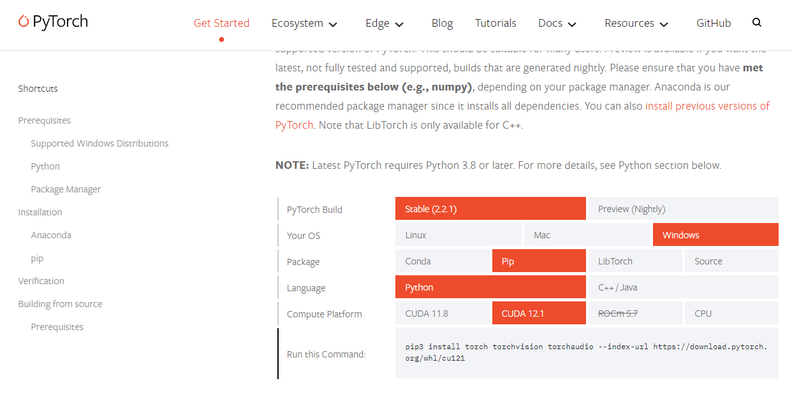
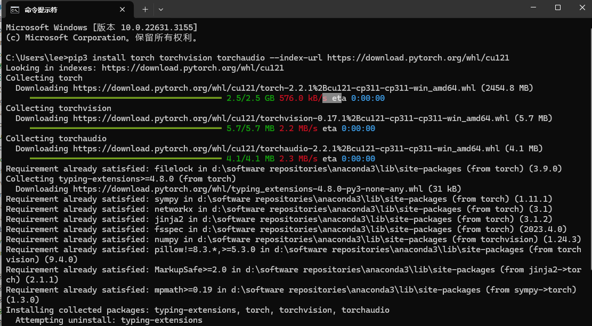

# 安装配置-PyTorch的安装和配置

## 一. 安装步骤
1. 访问官网并安装
    + 访问官网https://pytorch.org/get-started/locally/
    
    + 根据自己的系统设置需要安装的版本
        
        复制"Run this Command:"后的命令行
        ```ssh
        pip3 install torch torchvision torchaudio --index-url https://download.pytorch.org/whl/cu121
        ```
        在终端运行
        
        等待安装完成
2. 检验安装是否完成
    在终端中输入
    ```ssh
    C:\Users\lee> python
    Python 3.11.5 | packaged by Anaconda, Inc. | (main, Sep 11 2023, 13:26:23) [MSC v.1916 64 bit (AMD64)] on win32
    Type "help", "copyright", "credits" or "license" for more information.
    >>> import torch
    >>> a = torch.ones((3,1))
    >>> a = a.cuda(0)
    >>> b = torch.ones((3,1)).cuda(0)
    >>> a + b
    tensor([[2.],
            [2.],
            [2.]], device='cuda:0')
    >>>
    ```


        


