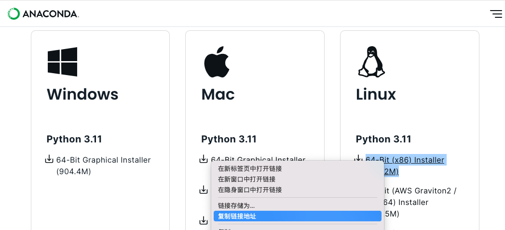

# 软件安装：关于Anaconda使用指南 -Python+Anaconda

<!-- @import "[TOC]" {cmd="toc" depthFrom=1 depthTo=6 orderedList=false} -->

<!-- code_chunk_output -->

- [软件安装：关于Anaconda使用指南 -Python+Anaconda](#软件安装关于anaconda使用指南--pythonanaconda)
  - [一. 安装](#一-安装)
    - [1.1 Linux安装](#11-linux安装)
  - [二. Anaconda的环境管理](#二-anaconda的环境管理)
    - [1. 创建新环境](#1-创建新环境)
    - [2. 激活环境/切换环境](#2-激活环境切换环境)
    - [3. 查看python版本](#3-查看python版本)
    - [4. 删除某个环境](#4-删除某个环境)
    - [5. 查看已安装的环境](#5-查看已安装的环境)
    - [6. 退出某个环境(python34)](#6-退出某个环境python34)
  - [三. Anaconda的包管理](#三-anaconda的包管理)
    - [1. 查看当前环境下已安装的包](#1-查看当前环境下已安装的包)
    - [2. 查看某个指定环境(python34)的已安装包](#2-查看某个指定环境python34的已安装包)
    - [3. 安装package](#3-安装package)
    - [4. 更新package](#4-更新package)
    - [5. 删除package](#5-删除package)
  - [设置清华镜像](#设置清华镜像)
  - [Mac 中 PyCharm 配置 Anaconda环境](#mac-中-pycharm-配置-anaconda环境)

<!-- /code_chunk_output -->


## 一. 安装
### 1.1 Linux安装
1. 下载
    去[官网](https://www.anaconda.com/download/success)找到下载地址(如图)
    
    联接到linux服务器, 用`wget`下载
    ```sh
    wget https://repo.anaconda.com/archive/Anaconda3-2024.02-1-Linux-x86_64.sh
    ```
2. 执行
    ```sh
    bash Anaconda3-5.3.1-Linux-x86_64.sh
    ```
    进行Anaconda的安装
3. 进入安装程序，提示输入“`ENTER`”继续：
    ```sh
    Please, press ENTER  to continue
    >>> ENTER
    ```
4. 输入yes确认接受许可协议
    ```sh
    Do you accept the license terms? [yes|no]
    [no] >>> yes
    ```
5. 确认Anaconda的安装位置, 可改可不改
    ```sh
    Anaconda3 will now be installed into this location:
    /root/anaconda3
        - Press ENTER to confirm the location
        - Press CTRL-C to abort the installation
        - Or specify a different location below
    [/root/anaconda3] >>> /opt/anaconda3
    ```
    > 其实安装位置可以在执行安装脚本的时候直接指定，像上面要指定安装到/opt/anaconda3目录下，可以这样修改执行内容：，这样这一步就可以直接回车了
    `bash bash Anaconda3-5.3.1-Linux-x86_64.sh -p /opt/anaconda3`

6. 安装完成后，出现询问是否在用户的`.bashrc`文件中初始化Anaconda3的相关内容。
    ```sh
    Do you wish the installer to initialize Anaconda3 by running conda init? [yes|no]
    [no] >>> yes
    ```

7. 执行下：`source ~/.bashrc`，之后就可以正常使用了。


## 二. Anaconda的环境管理
### 1. 创建新环境  
Conda的环境管理功能允许我们同时安装若干不同版本的Python，并能自由切换。  
```
conda create --name python34 python=3.4
```
+ 创建一个名为python34的环境，指定Python版本是3.4（不用管是3.4.x，conda会为我们自动寻找3.4.x中的最新版本）  

### 2. 激活环境/切换环境
+ Win
    ```
    conda activate python34 
    ```
    + `python34`需要更改为你想激活的环境名
    + 若激活不成功
        1. 选择管理员方式进入powershell
        2. 执行 
            ```
            conda init powershell
            ```
        3. 重新打开powershell若显示`base`则成功了，可输入
            ```
            conda activate env_name(conda 不能省)
            ```
            若仍不显示`base`， 转入第4步。
        4. 执行`get-ExecutionPolicy`，若回复`Restricted`，表示状态是禁止的。
            执行`set-ExecutionPolicyRemoteSigned`，在出现的结果中输入`Y`并回车，设置完毕。
        5. 重新打开powershell，即可看到命令行开头有`(base)`，输入`conda activate envs_name` 命令即可激活相应的虚拟环境
+ Linux & Mac
    ```
    source activate python34 
    ```
    + `python34`需要更改为你想激活的环境名

### 3. 查看python版本
```
# 此时，再次输入
python --version
# 可以得到`Python 3.4.5 :: Anaconda 4.1.1 (64-bit)`，即系统已经切换到了3.4的环境
```
### 4. 删除某个环境
```
# 删除一个名为‘python34’的环境
conda remove --name python34 --all
```
### 5. 查看已安装的环境
```
conda info -e
# 当前被激活的环境会显示有一个星号或者括号
```
用户安装的不同python环境都会被放在目录~/anaconda3/envs下.
### 6. 退出某个环境(python34)
```
source deactivate python34
```


## 三. Anaconda的包管理
### 1. 查看当前环境下已安装的包
```
conda list
```
### 2. 查看某个指定环境(python34)的已安装包
```
connda list -n python34
```
### 3. 安装package
确定在当前环境
```
pip install numpy
```
否则, 切换环境 或 指定环境下载
```
pip install -n python34 numpy
```
也可以通过-c指定通过某个channel安装

### 4. 更新package
```
conda update -n python34 numpy
```
conda将conda、python等都视为package，因此，完全可以使用conda来管理conda和python的版本，例如
```
# 更新conda，保持conda最新
conda update conda

# 更新anaconda
conda update anaconda

# 更新python
conda update python
# 假设当前环境是python 3.4, conda会将python升级为3.4.x系列的当前最新版本
```
### 5. 删除package
```
conda remove -n python34 numpy
```

## 设置清华镜像
1. 设置镜像
    ```
    conda config --add channels https://mirrors.tuna.tsinghua.edu.cn/anaconda/pkgs/main/
    conda config --add channels https://mirrors.tuna.tsinghua.edu.cn/anaconda/pkgs/free/
    conda config --add channels https://mirrors.tuna.tsinghua.edu.cn/anaconda/cloud/conda-forge/
    conda config --add channels https://mirrors.tuna.tsinghua.edu.cn/anaconda/cloud/msys2/
    conda config --add channels https://mirrors.tuna.tsinghua.edu.cn/anaconda/cloud/bioconda/
    conda config --add channels https://mirrors.tuna.tsinghua.edu.cn/anaconda/cloud/menpo/
    conda config --add channels https://mirrors.tuna.tsinghua.edu.cn/anaconda/cloud/pytorch/
    conda config --set show_channel_urls yes
    ```
2. 设置搜索时显示通道地址
    ```
    conda config --set show_channel_urls yes
    ```

3. 查看镜像源是否设置成功
    ```
    conda config --show
    ```     
    + 如果想要**切换回默认的镜像源**，使用命令
        ```
        conda config --remove-key channels
        ```

## Mac 中 PyCharm 配置 Anaconda环境
1. 点击左上角PyCharm，进入偏好设置(Preferences)中，Mac 中的快捷键是`command` + `,`
2. 选择`Project Interprete`
3. 点击右上角的齿轮，后点击`Add…`
4. 选择是 `System Interpreter`
5. 点击右上角省略号选择文件，选择anaconda3文件夹，并打开，找到 `python.app`文件夹，并打开。python.app文件夹中的 Mac OS 文件夹，并打开，选中 python
5. 等待完成

**附**: 
1. （已经确认通过Anaconda安装过该模块）像Django库，若在程序运行中报错没有此模块:
    + 点击左上角PyCharm，进入偏好设置(Preferences)中;
    + 选择Project: XXXX -> Project Interprete
    + 点击右栏下面的“+”，搜索该模块；
    + 找到后点击下面的Install Package，等待即可；
