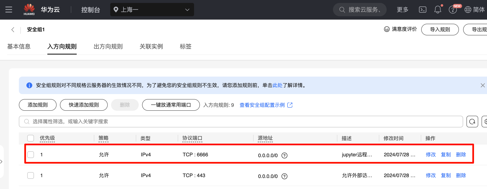
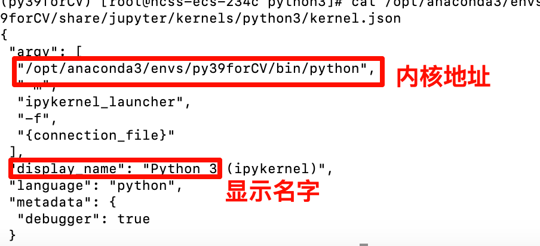

# 安装配置 - 远程Jupyter安装与配置

<!-- @import "[TOC]" {cmd="toc" depthFrom=2 depthTo=6 orderedList=false} -->

<!-- code_chunk_output -->

- [〇. 写在前面](#〇-写在前面)
  - [0.1 配置信息](#01-配置信息)
  - [0.2 安装内容](#02-安装内容)
- [二. 安装](#二-安装)
  - [1. 安装Miniconda](#1-安装miniconda)
  - [2. 配置云服务器安全组](#2-配置云服务器安全组)
  - [3. 通过MiniConda安装Jupyter](#3-通过miniconda安装jupyter)
- [三. 备忘录](#三-备忘录)
  - [3.1 jupyter使用的Python内核配置](#31-jupyter使用的python内核配置)
  - [3.2 Jupyter设置代码段自动补全和提示](#32-jupyter设置代码段自动补全和提示)
  - [3.3 jupyter notebook中显示目录](#33-jupyter-notebook中显示目录)

<!-- /code_chunk_output -->


## 〇. 写在前面
### 0.1 配置信息
- 操作系统：CentOS 8.2 64bit (华为云服务器)

### 0.2 安装内容
- Anaconda安装与配置
- Python版本：3.8.5
- Jupyter版本：1.0.0

## 二. 安装
### 1. 安装Miniconda
1. 访问官网
    [Miniconda官网](https://docs.anaconda.com/miniconda/)
    
2. 找到页面中的安装步骤


### 2. 配置云服务器安全组

此处已经设置端口号6666为开放状态
**注意**: 发现端口6666无法访问Jupyter, 建议换成8888

### 3. 通过MiniConda安装Jupyter

1. 查看当前环境有哪些
    ```
    conda env list
    ```
2. 创建环境
    ```
    conda create -n jupyter python=3.8.5
    ```
3. 激活环境
    ```
    conda activate jupyter
    ```
4. 安装Jupyter
    ```
    conda install -c conda-forge jupyter
    ```
5. 安装完之后运行下面指令创建Jupyter默认配置文件。
    ```
    jupyter notebook --generate-config
    ```

6. 设置密码
    + 方法1
        ```bash
        jupyter notebook password
        ```
        要求输入两次, 然后会给出一个文件路径, 如
        ```
        Enter password: 
        Verify password: 
        [JupyterPasswordApp] Wrote hashed password to /root/.jupyter/jupyter_server_config.json
        ```
        然后在json文件中查看密码的hash值，
        ```
        cat /root/.jupyter/jupyter_server_config.json
        ```
        可以看到下面类似内容
        ```
        {
            "IdentityProvider": {
            "hashed_password": "argon2:$argon2i0XXXXX"
        }
        ```
    + 方法2
        命令行
        ```
        ipython
        ```
        然后输入
        ```python
        from notebook.auth import passwd

        passwd()
        ```
        > 新版notebook7用 `from jupyter_server.auth import passwd`

        然后会自动出现hash值

7. (可选)创建jupyter工作目录
    ```
    mkdir ~/jupyter_workspace
    ```
8. 修改jupyter notebook的配置文件
    ```bash
    vim ~/.jupyter/jupyter_notebook_config.py
    ```
    末尾追加内容
    ```
    #允许远程连接
    c.NotebookApp.allow_remote_access = True
    # 设置所有ip皆可访问
    c.NotebookApp.ip = '*'
    # 单引号内换成上一步骤得到的hash密码,或者输入的字符
    c.NotebookApp.password = u'argon2:$argon2id$v=19$m=10240,t=10,p=8$8Ml87fAVi32P97x7msG9tQ$3vIrsafozXPix7ZORH1oPDp1kPScvPvtfR5hJOedjS0'
    # 禁止自动打开浏览器
    c.NotebookApp.open_browser = False
    # 指定一个端口, 在华为云服务器安全组中设置'出方向规则端口'
    c.NotebookApp.port = 6666
    # 启动的默认目录, 这里用了第7步创建的目录
    c.NotebookApp.notebook_dir = '/root/jupyter_workspace'
    # 是否允许root用户登陆
    c.NotebookApp.allow_root = True
    ```

9. 保存退出，然后重启Jupyter。
    + 普通运行
        ```
        jupyter notebook
        ```
    + 后台运行
        ```
        nohup jupyter notebook >~/jupyter.log 2>&1 &
        ```
    + 关闭服务
        ```
        ps -ef |grep jupyter      
        kill -9 "进程号"          
        ```

10. 打开浏览器，输入`http://远程服务器IP:端口号`访问Jupyter
    http://121.37.182.156:8888/ 


## 三. 备忘录
### 3.1 jupyter使用的Python内核配置
1. 查看jupyter的内核地址
    ```
    jupyter kernelspec list
    ```
2. 进入上一步返回的目录
    ```
    cd /usr/local/share/jupyter/kernels/python3
    ls
    ```
    编辑内核配置文件
    ```
    vim kernel.json
    ```
    
    修改jupyter内核配置文件，内核地址可配置多个，在jupyter页面中切换

### 3.2 Jupyter设置代码段自动补全和提示
1. 先安装jupyter拓展包
    ```
    conda install jupyter_contrib_nbextensions
    ```
2. 配置 `nbextension`，如果已开启jupyter 服务的话，先关闭服务
    ```
    # 初始化插件
    jupyter-contrib-nbextension install --user
    ```
3. 启动jupyter后进入页面发现多了一行 **Nbextensions** 选项， 打开并勾选 Hinterland选项，如果点不了，上面disable选项修改一下

### 3.3 jupyter notebook中显示目录
```
pip install jupyter_contrib_nbextensions
```
```
jupyter contrib nbextension install --user
```
最后启动jupyter notebook，选择 Nbextensions，勾选 **Table of Contents**
最后勾选上面disable


