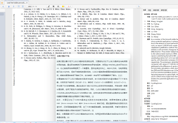

# 备忘录-Zotero文献管理软件

<!-- @import "[TOC]" {cmd="toc" depthFrom=2 depthTo=6 orderedList=false} -->

<!-- code_chunk_output -->

- [〇. 中文社区](#〇-中文社区)
- [一. 软件概述](#一-软件概述)
- [二. 软件设置](#二-软件设置)
- [三. 插件推荐](#三-插件推荐)
  - [Jasminum - 茉莉花](#jasminum---茉莉花)
  - [zotero-pdf-preview](#zotero-pdf-preview)
  - [zotero-better-notes](#zotero-better-notes)
  - [zotero-style](#zotero-style)
  - [zotero-tag](#zotero-tag)
  - [zotfile](#zotfile)
  - [gpt](#gpt)
- [四. 其他插件](#四-其他插件)
  - [zotero connector](#zotero-connector)
  - [easySchotor](#easyschotor)
- [问题汇总](#问题汇总)
  - [1. 不明所以的目录-在目录栏出现`Addon Item`目录](#1-不明所以的目录-在目录栏出现addon-item目录)

<!-- /code_chunk_output -->

## 〇. 中文社区
1. 社区网站
    https://zotero-chinese.com/

2. 参考文献相关
    1. 参考文献使用方法: https://zotero-chinese.com/user-guide/citation-styles.html
    2. 推荐格式: 
        + 基于2015格式改, 顺序编码, 双语, 姓名取消大写, 无 URL DOI, 引注有页码, [链接](https://github.com/redleafnew/Chinese-STD-GB-T-7714-related-csl/blob/main/023gb-t-7714-2015-numeric-bilingual-no-uppercase-no-url-doi-with-locator.csl)


## 一. 软件概述
1. 管理文献


## 二. 软件设置
1. Zotero文件夹
    > zotero将文献放在哪里了
    找 首选项 -> 高级 -> 文件和文件夹 -> 数据存储位置
    在数据存储位置项目下面即可看到文件地址, 并可以更改为自定义位置
    如图
    
    
    + 文件位置在 zotfile 插件中会用到


## 三. 插件推荐
> 插件安装流程：
Zotero -> 工具 -> 插件 -> 右上小齿轮图标 -> Install Add-on From File ... -> 选择下载好的xpi文件

注意: 部分插件需要重启zotero

### Jasminum - 茉莉花
> 推荐
1. 中文插件，旨在提升 Zotero 中文用户的使用体验。主要功能有：
    - 中文期刊附件（PDF/CAJ）的元数据抓取，支持添加PDF/CAJ时自动抓取元数据功能
    - 集成 Zotero 中文社区转换器的下载与更新功能
    - 为知网学位论文PDF添加章节书签（依赖于PDFtk）
    - 更新中文文献引用次数，核心期刊信息
    - 合并/拆分姓，名，识别文献条目语言，下载知网附件，统一日期格式等

2. 安装下载地址：
    https://github.com/l0o0/jasminum


### zotero-pdf-preview
> 推荐
1. 作用：点击文献条目之后，在右边的窗格里显示缩小版论文内容。

2. 安装下载地址：
    https://github.com/windingwind/zotero-pdf-preview/releases

    安装排雷：
    1. 安装若显示【无法安装插件“%S”。它可能无法与该版本的 Zotero 兼容。】
        这是对于zotero新版本，旧版本的插件没有适配导致的，尝试旧版本插件即可


### zotero-better-notes
> 推荐
1. 作用：
    笔记和思维导图
    + 笔记基于markdown，可以插入图片
    + 可以链接到文献的具体位置
    
2. 地址： 
    + Github地址：
        https://github.com/windingwind/zotero-better-notes/tree/master
    + 下载地址： 
        https://github.com/windingwind/zotero-better-notes/releases/tag/1.0.4


3. 笔记模板功能
    > 部分模板需要同时使用[zotero-style]插件
    1. 笔记模板设计路径:
        首选项->Bnotes->打开模板编辑器, 创建新模板
    2. 模板库: 
        GitHub分享链接: https://github.com/windingwind/zotero-better-notes/discussions/categories/note-templates
        
        已用好模板: 
        + https://github.com/windingwind/zotero-better-notes/discussions/729
        + 中文模板
            ```html
            <html style="background-color=#333333;">
            </hr>
            <table border="1">
            <h1 style="color:  #E65100; background-color:  #FFF8E1;">(${topItem.getField("date")}) ${topItem.getField("title")}</h1>
            <tr>
            <td><b>期刊: <b style="color:#FF0000">${topItem.getField('publicationTitle')}</b></b>（发表日期: <b>${topItem.getField("date")}</b>）<br><b>作者:</b> ${topItem.getCreators().map((v)=>v.firstName+" "+v.lastName).join("; ")}</td>
            </tr>
            <tr>
            <td><b>摘要: </b><i>${topItem.getField('abstractNote')}</i></td>
            </tr>
            <tr>
            <td><b>期刊分区: </b>
            <!-- 引用了zotero style插件的标签，请提前安装，否则找不到分区 -->
            ${(() => {let space = " ㅤㅤ ㅤㅤ"
                            return Array.prototype.map.call(Zotero.ZoteroStyle.data.ztoolkit.ItemTree.globalCache.renderCellHooks.PublicationTags(
                0,
                Zotero.ZoteroStyle.data.ztoolkit.ItemTree.fieldHooks.globalCache.getFieldHooks.PublicationTags(
                "", true, true,
                topItem, undefined)
                ).childNodes,
                e => {
                e.innerText = space + space + e.innerText + space + space;
                return e.outerHTML
                }).join(space)
                })()
                }
            </td>
            </tr>
            <tr>
            <td><b>原文PDF链接: </b>
            <!-- 前提是有pdf附件，否则也找不到 -->
            <a href=zotero://open-pdf/0_${Zotero.Items.get(topItem.getAttachments()).filter((i) => i.isPDFAttachment())[0].key}>${Zotero.Items.get(topItem.getAttachments()).filter((i)=> i.isPDFAttachment())[0].getFilename()} 
                </a>
            </td>
            </tr>
            <tr>
            <td><b>笔记创建日期: </b>${new Date().toLocaleString()}</td>
            </tr>
            </table>
            <!-- Tips不想要可以自行删掉 -->
            <h2>💡创新点</h2>
            <blockquote>Tips: 本文提出了什么<u>新的科学问题</u>，提出了什么<u>新的研究思路</u>，或提出了什么<u>新的研究工具</u>？
            </blockquote>
            <p></p>
            <h2>📚前言及文献综述</h2>
            <blockquote>Tips: 本研究的<u>必要性、紧迫性、可行性</u>是什么？作者是如何论述的？<br>作者引用了哪些该领域的<u>开创性文献</u>？</blockquote>
            <p></p>
            <h2>🧩数据</h2>
            <p></p>
            <h2>🔬做了什么？</h2>
            <p></p>
            <h2>📌重要内容摘录</h2>
            <p></p>
            <h2>📜结论</h2>
            <p></p>
            <h2>🤔思考</h2>
            <blockquote>Tips: 本文有什么<u>优缺点</u>？你是否对某些内容产生了<u>疑问</u>？<br>你是否认为某些研究方式可以改进，<u>如何改进</u>？</blockquote>
            <p></p>
            </html>
            ```
        + 英文文献笔记模板
            ```html
            <html>
            </hr>
            <table border="1">

            <!-- 这里提取了翻译标题，也要安装Zotero PDF Translate插件，否则只会显示英文标题 -->
            <h1 style="color:  #E65100; background-color:  #FFF8E1;">(${topItem.getField("date")}) ${topItem.getField("title")}（${topItem.getField("titleTranslation")}）</h1>

            <tr>
            <td><b>期刊: <b style="color:#FF0000">${topItem.getField('publicationTitle')}</b></b>（发表日期: <b>${topItem.getField("date")}</b>）<br><b>作者:</b> ${topItem.getCreators().map((v)=>v.firstName+" "+v.lastName).join("; ")}</td>
            </tr>

            <tr>
            <td><b>摘要翻译: </b>
            <!-- 要提前安装Zotero PDF Translate插件，否则摘要翻译找不到 -->
            <i>${topItem.getField('abstractTranslation')}</i></td>
            </tr>

            <tr>
            <td><b>期刊分区: </b>
            <!-- 引用了zotero style插件的标签，需要安装此插件，否则分区找不到-->
            ${(() => {let space = " ㅤㅤ ㅤㅤ"
                            return Array.prototype.map.call(Zotero.ZoteroStyle.data.ztoolkit.ItemTree.globalCache.renderCellHooks.PublicationTags(
                0,
                Zotero.ZoteroStyle.data.ztoolkit.ItemTree.fieldHooks.globalCache.getFieldHooks.PublicationTags(
                "", true, true,
                topItem, undefined)
                ).childNodes,
                e => {
                e.innerText = space + space + e.innerText + space + space;
                return e.outerHTML
                }).join(space)
                })()
                }
            </td>
            </tr>

            <tr>
            <td><b>原文PDF链接: </b>
            <!-- 前提是有pdf附件，否则也找不到 -->
            <a href=zotero://open-pdf/0_${Zotero.Items.get(topItem.getAttachments()).filter((i) => i.isPDFAttachment())[0].key}>${Zotero.Items.get(topItem.getAttachments()).filter((i)=> i.isPDFAttachment())[0].getFilename()} 
                </a>
            </td>
            </tr>

            <tr>
            <td><b>笔记创建日期: </b>${new Date().toLocaleString()}</td>
            </tr>

            </table>
            <!-- Tips不想要可以自行删掉 -->
            <h2>💡创新点</h2>
            <blockquote>Tips: 本文提出了什么<u>新的科学问题</u>，提出了什么<u>新的研究思路</u>，或提出了什么<u>新的研究工具</u>？
            </blockquote>
            <p></p>

            <h2>📚前言及文献综述</h2>
            <blockquote>Tips: 本研究的<u>必要性、紧迫性、可行性</u>是什么？作者是如何论述的？<br>作者引用了哪些该领域的<u>开创性文献</u>？</blockquote>
            <p></p>

            <h2>🧩数据/工具箱</h2>
            <p></p>

            <h2>🔬做了什么？</h2>
            <p></p>

            <h2>📌重要内容摘录</h2>
            <p></p>

            <h2>📜结论</h2>
            <p></p>

            <h2>🤔思考</h2>
            <blockquote>Tips: 本文有什么<u>优缺点</u>？你是否对某些内容产生了<u>疑问</u>？<br>你是否认为某些研究方式可以改进，<u>如何改进</u>？</blockquote>
            <p></p>

            </html>
            ```


 

### zotero-style
> 推荐
1. 作用:
    记录文献读取进度,并以颜色进度条显示

2. 地址:
    + 介绍Github:
        https://github.com/MuiseDestiny/zotero-style
    + 下载地址:
        https://github.com/MuiseDestiny/zotero-style/releases/tag/2.6.7

3. 使用
    + 需要在文献目录的表头鼠标右键,添加`进度`列
    
    在标题栏(如下图黑框)右键, 可以添加不同的列  
    
    
    有几个推荐的列, 及设置:
    1. 评级
        + 根据上述操作,添加"评级"列
        + 在鼠标放在标题栏的"评级"列, 鼠标右键, 选择"列设置"
        + 在弹出的选项卡中
            - `mark`为评级后标志
                推荐: `★`
            - `option` 为未选的标记
                推荐: `☆`
            - `color` 为颜色
                推荐: `#FFBF00`
            - `size`
                推荐: 四分之一
            - `padding`
                推荐: 最小
    2. 期刊标签
        + 设置期刊查询key
            - 在链接https://www.easyscholar.cc/console/user/open, 登陆注册, 找到我的"开放接口", 再找到"密钥SecretKey", 复制这个key
            - 打开zotero, 首选项->高级->"高级设置"编辑器->弹框点击"I accept the risk"->搜索"easy"找到如下图的选项,点击->在弹框里输入刚才的key, ok退出
            

        + 根据上述操作,添加"期刊标签"列
        + 在鼠标放在标题栏的"期刊标签"列, 鼠标右键, 选择"列设置"
            - `Fields` 输入标签类型
                - 可以参考[Fields参考](https://github.com/MuiseDestiny/zotero-style)
                - 建议`sci, sciUp, sciif,pku,ccf, sciwarn`
            - `Map` 将一些冗长的标签通过正则表达式匹配后简化
                - 同样可以参考[Fields参考](https://github.com/MuiseDestiny/zotero-style)
                - 建议
                    ```
                    SCIIF=IF, SCI升级版=SCI, /医学(\d+)区/=医$1,  /生物学(\d+)区/=生$1,  /农林科学(\d+)区/=农$1,  /环境科学与生态学(\d+)区/=环$1,  /化学(\d+)区/=化$1,  /工程技术(\d+)区/=工$1,  /数学(\d+)区/=数$1,  /物理与天体物理(\d+)区/=物$1,  /地球科学(\d+)区/=地$1,  /材料科学(\d+)区/=材$1,  /计算机科学(\d+)区/=计$1,  /经济学(\d+)区/=经$1,  /法学(\d+)区/=法$1,  /管理学(\d+)区/=管$1,  /心理学(\d+)区/=心$1,  /人文科学(\d+)区/=人$1,  /教育学(\d+)区/=教$1,  /综合性期刊(\d+)区/=综$1, 北大中文核心=北核, SCIWARN=🚫, EI检索=EI, 
                    ```
            - `rank colors`
                推荐: `#ffe2dd, #e8deee, #dbeddb, #fadec9, #e9e8e7`
            - `default color`
                推荐: `#86dad1`
    


### zotero-tag
> 推荐
1. 作用
    在文献目录中可以在`#标签`一栏中显示具体内容

2. 使用
    1. 打开"首选项"->zotero tag, 设置想要的快捷键
        - 推荐, 如下图  
            
    2. 标签颜色设置  
        如图,  
        
        + 在界面的左下角, 找到相应标签, 右键, 找到改颜色的选项;
            - 推荐颜色:
                - 是否阅读->红色
                - 文献大类->绿色
                - 方向细分->紫色
            

### zotfile
> 暂不推荐

1. 作用：
    zotero中文件存储比较杂，每个PDF文件都在不同的文件夹里，这款软件可以把所有的PDF提取出来。

2. 下载地址：
    http://zotfile.com/

3. 弊端
    zotero的文档无法通过坚果云同步! 因此不推荐
    

### gpt
> 推荐
1. 作用: 
    使用chatgpt

2. 安装配置路径 
    > 参考UP主Polygononon于23年8月24日的教程[Zotero GPT - 使用教程，配置免费密钥！！！](https://www.bilibili.com/video/BV17N4y1o7vx/?spm_id_from=333.337.top_right_bar_window_history.content.click&vd_source=d8702308ded7a25961207aebfb814cfd)
    1. 安装插件
        下载地址:
        https://github.com/MuiseDestiny/zotero-gpt/releases/tag/0.2.9
        > 注意区分哪些时适配zotero7的版本, 上面链接时zotero6的插件版本

    2. 正常流程安装插件
        启动/呼出gpt对话框方式:
        + 方法1: zotero标题栏有gpt的小图标
        + 方法2: 如果没有gpt图标, 按下`ctrl`+`/`快捷键呼出gpt对话框
    
    3. 配置gpt密钥
        1. 访问https://github.com/chatanywhere/GPT_API_free
        2. 获取密钥
            点击红圈的"申请领取内测免费API Key",
            
            在认证github登录后, 会跳转到一个网页显示密钥,如图
            
        3. 返回zotero
            + 按下`ctrl`+`/`快捷键呼出gpt对话框
            + 输入框输入`/`, 下拉框中选择`secretKey`(下图中红标)
                
                空格,输入`sk-xxxx`开头的密钥, 如
                ```
                /secretKey sk-hjfsahjdfadbfadkhfdf
                ```
                点击回车会出现如下返回
                
        4. 配置API
            + 返回https://github.com/chatanywhere/GPT_API_free 页面
            + 找到"转发Host1: https://api.chatanywhere.com.cn (国内中转，延时更低，推荐)"
                - 如上面第一张图(获取密钥.png)的黄圈部分
                - 复制链接, https://api.chatanywhere.com.cn
            + 回到zotero
                + 按下`ctrl`+`/`快捷键呼出gpt对话框
                + 输入框输入`/`, 下拉框中选择`API`(下图中红标)
                
                空格,输入`https://api.chatanywhere.com.cn`开头的密钥, 如
                ```
                /API https://api.chatanywhere.com.cn
                ```
                点击回车

        5. 测试
            打开一篇文章, 让gpt总结一下
            
        

## 四. 其他插件
### zotero connector 
1. chrome插件, 可以直接将网页的文献保存到zotero软件中
2. 不好用

### easySchotor
1. chrome插件, 可以在浏览器之间显示文献的评价(包括影响因子\分区等)
2. 应该是通过爬虫实现, 存在一定风险

## 问题汇总
### 1. 不明所以的目录-在目录栏出现`Addon Item`目录
这个是基于zotero-style插件的目录. 此目录的作用是记录文件的阅读时间, 以生成进度条.
如
```
3NKHCKZA {"readingTime":{"page":70,"data":{"0":10,"1":10,"3":80,"6":10,"8":80}}}
```
表示文献共第70页page, 第0(1)页阅读10s, et