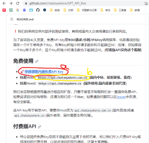
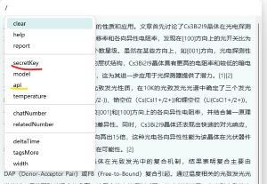

# 备忘录-Zotero文献管理软件

## 一. 软件概述
1. 管理文献

## 二. 软件设置
1. Zotero文件夹
    > zotero将文献放在哪里了
    找 首选项 -> 高级 -> 文件和文件夹 -> 数据存储位置
    在数据存储位置项目下面即可看到文件地址, 并可以更改为自定义位置
    如图
    
    
    + 文件位置在 zotfile 插件中会用到


## 二. 插件推荐
> 插件安装流程：
Zotero -> 工具 -> 插件 -> 右上小齿轮图标 -> Install Add-on From File ... -> 选择下载好的xpi文件

注意: 部分插件需要重启zotero

### Jasminum - 茉莉花
> 推荐
1. 中文插件，旨在提升 Zotero 中文用户的使用体验。主要功能有：
    - 中文期刊附件（PDF/CAJ）的元数据抓取，支持添加PDF/CAJ时自动抓取元数据功能
    - 集成 Zotero 中文社区转换器的下载与更新功能
    - 为知网学位论文PDF添加章节书签（依赖于PDFtk）
    - 更新中文文献引用次数，核心期刊信息
    - 合并/拆分姓，名，识别文献条目语言，下载知网附件，统一日期格式等

2. 安装下载地址：
    https://github.com/l0o0/jasminum


### zotero-pdf-preview
> 推荐
1. 作用：点击文献条目之后，在右边的窗格里显示缩小版论文内容。

2. 安装下载地址：
    https://github.com/windingwind/zotero-pdf-preview/releases

    安装排雷：
    1. 安装若显示【无法安装插件“%S”。它可能无法与该版本的 Zotero 兼容。】
        这是对于zotero新版本，旧版本的插件没有适配导致的，尝试旧版本插件即可


### zotero-better-notes
> 推荐
1. 作用：
    笔记和思维导图
    + 笔记基于markdown，可以插入图片
    + 可以链接到文献的具体位置
    
2. 地址： 
    + Github地址：
        https://github.com/windingwind/zotero-better-notes/tree/master
    + 下载地址： 
        https://github.com/windingwind/zotero-better-notes/releases/tag/1.0.4


3. 笔记模板功能
    > 部分模板需要同时使用[zotero-style]插件
    1. 笔记模板设计路径:
        首选项->Bnotes->打开模板编辑器, 创建新模板
    2. 模板库: 
        GitHub分享链接: https://github.com/windingwind/zotero-better-notes/discussions/categories/note-templates
        
        已用好模板: 
        + https://github.com/windingwind/zotero-better-notes/discussions/729


 

### zotero-style
> 推荐
1. 作用:
    记录文献读取进度,并以颜色进度条显示

2. 地址:
    + 介绍Github:
        https://github.com/MuiseDestiny/zotero-style
    + 下载地址:
        https://github.com/MuiseDestiny/zotero-style/releases/tag/2.6.7

3. 使用
    需要在文献目录的表头鼠标右键,添加`进度`列


### zotero-tag
> 推荐
1. 作用
    在文献目录中可以在`#标签`一栏中显示具体内容
    

### zotfile
> 暂不推荐

1. 作用：
    zotero中文件存储比较杂，每个PDF文件都在不同的文件夹里，这款软件可以把所有的PDF提取出来。

2. 下载地址：
    http://zotfile.com/

3. 弊端
    zotero的文档无法通过坚果云同步! 因此不推荐
    

### gpt
> 推荐
1. 作用: 
    使用chatgpt

2. 安装配置路径 
    > 参考UP主Polygononon于23年8月24日的教程[Zotero GPT - 使用教程，配置免费密钥！！！](https://www.bilibili.com/video/BV17N4y1o7vx/?spm_id_from=333.337.top_right_bar_window_history.content.click&vd_source=d8702308ded7a25961207aebfb814cfd)
    1. 安装插件
        下载地址:
        https://github.com/MuiseDestiny/zotero-gpt/releases/tag/0.2.9
        > 注意区分哪些时适配zotero7的版本, 上面链接时zotero6的插件版本

    2. 正常流程安装插件
        启动/呼出gpt对话框方式:
        + 方法1: zotero标题栏有gpt的小图标
        + 方法2: 如果没有gpt图标, 按下`ctrl`+`/`快捷键呼出gpt对话框
    
    3. 配置gpt密钥
        1. 访问https://github.com/chatanywhere/GPT_API_free
        2. 获取密钥
            点击红圈的"申请领取内测免费API Key",
            
            在认证github登录后, 会跳转到一个网页显示密钥,如图
            
        3. 返回zotero
            + 按下`ctrl`+`/`快捷键呼出gpt对话框
            + 输入框输入`/`, 下拉框中选择`secretKey`(下图中红标)
                
                空格,输入`sk-xxxx`开头的密钥, 如
                ```
                /secretKey sk-hjfsahjdfadbfadkhfdf
                ```
                点击回车会出现如下返回
                
        4. 配置API
            + 返回https://github.com/chatanywhere/GPT_API_free 页面
            + 找到"转发Host1: https://api.chatanywhere.com.cn (国内中转，延时更低，推荐)"
                - 如上面第一张图(获取密钥.png)的黄圈部分
                - 复制链接, https://api.chatanywhere.com.cn
            + 回到zotero
                + 按下`ctrl`+`/`快捷键呼出gpt对话框
                + 输入框输入`/`, 下拉框中选择`API`(下图中红标)
                
                空格,输入`https://api.chatanywhere.com.cn`开头的密钥, 如
                ```
                /API https://api.chatanywhere.com.cn
                ```
                点击回车

        5. 测试
            打开一篇文章, 让gpt总结一下
            
        

## 其他插件
### zotero connector 
1. chrome插件, 可以直接将网页的文献保存到zotero软件中
2. 不好用

### easySchotor
1. chrome插件, 可以在浏览器之间显示文献的评价(包括影响因子\分区等)
2. 应该是通过爬虫实现, 存在一定风险

## 问题汇总
### 1. 不明所以的目录-在目录栏出现`Addon Item`目录
这个是基于zotero-style插件的目录. 此目录的作用是记录文件的阅读时间, 以生成进度条.
如
```
3NKHCKZA {"readingTime":{"page":70,"data":{"0":10,"1":10,"3":80,"6":10,"8":80}}}
```
表示文献共第70页page, 第0(1)页阅读10s, et