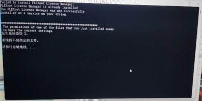
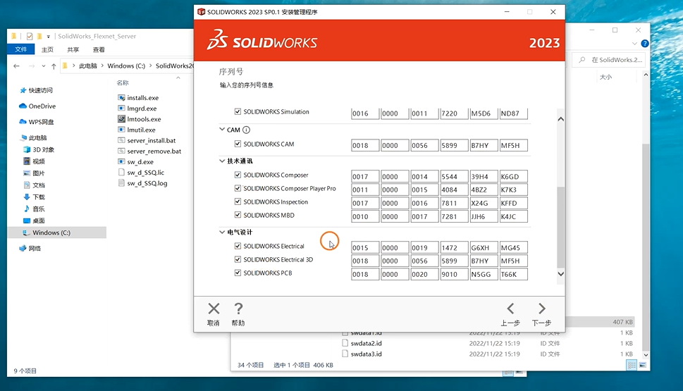

# 备忘录-SolidWorks2023安装教程

## 一. 教程
根据b站UP主"SW实战营"视频
[SolidWorks2023安装方法solidwork2023安装视频（非常详细）](https://www.bilibili.com/video/BV1o8411K7eN/?share_source=copy_web&vd_source=f07a36b3829106945a5ec1377ecea116)
如视频下架可看安装软件目录的视频

### 上述教程中, 需更改的地方/遇到的问题
1. 目录说明
    1. 原文件`SolidWorks.2023.SP0.1.Premium.DVD.iso`已经"解压"为`SolidWorks.2023.SP0.1.Premium.DVD`
    2. 原文件`_SolidSQUAD_.7z`改为`_SolidSQUAD_.zip`
    
2. 视频5'28 移动`SolidWorks_Flexnet_Server`目录
    视频中移动到C盘, 也必须挪到C盘,不能放到其他盘
    
3. 视频6'48 运行`server_install.bat`
    若运行失败, 出现以下错误提示
    
    
    + 解决办法: 
        找到同目录下的`server_remove.bat`右键管理员进行移除操作后, 再尝试运行`server_install.bat`

4. 视频10'00 运行Setup.exe安装失败, 显示`可执行文件"D:\Downloads in D disk\SolidWorks.2023.SP0.1.Premium.DVD\PreReqs\SQLServer\en_sql_server_2019`
    解决办法:
    1. 安装Microsoft Visual C++ 2005 Redistributable
        + Step1 下载Cpp2005程序
            > 有`vcredist_x64.EXE`和`vcredist_x86.EXE`两个程序
            + 方法1: 在官网下载
                https://www.microsoft.com/en-us/download/details.aspx?id=26347
                把x86和x64的都下载了, 
            + 方法2: 软件包里有Cpp2005目录里面有下载好的安装程序
        + Step2 替换
            将`vcredist_x64.EXE`和`vcredist_x86.EXE`两个程序替换
            - `./SolidWorks.2023.SP0.1.Premium.DVD\PreReqs\VCRedist10`
            - `./SolidWorks.2023.SP0.1.Premium.DVD\PreReqs\VCRedist11`
            - `./SolidWorks.2023.SP0.1.Premium.DVD\PreReqs\VCRedist12`
            - `./SolidWorks.2023.SP0.1.Premium.DVD\PreReqs\VCRedist16`
            
            四个目录下的同名程序. 注意`VCRedist16`下的要改一下名字.
    2. 序列号设置时, 不选电气设计
        
        黄框内容的几个不要勾选
        > 如果再次打开这个安装程序, 再选这个序列号为空,无法复原. 解决办法是重新按视频开头注入注册表, `server_install.bat`安装, 或先`server_remove.bat`再安装后即可再显示序列号.

## 二. 问题解决
1. 打开软件遇到'无法获得下列许可SOLIDWORKSStandard'问题解决 
    见文件`问题解决\问题解决-SolidWorks打开软件遇到'无法获得下列许可SOLIDWORKSStandard'问题解决 .md`