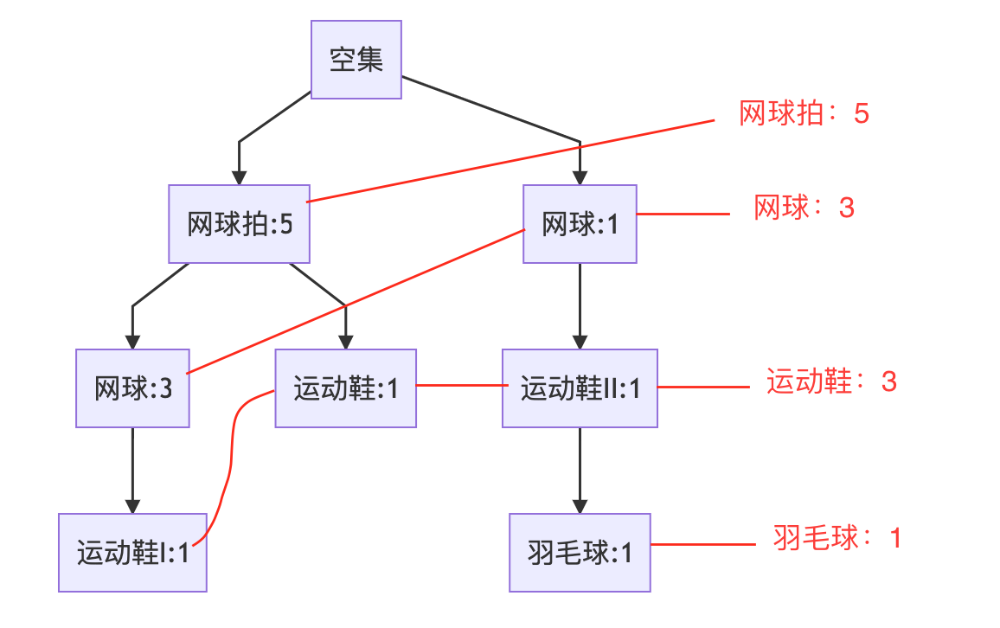

# 使用网上Python算法（Apriori算法和FPGrowth算法），实现关联结果


<!-- @import "[TOC]" {cmd="toc" depthFrom=2 depthTo=6 orderedList=false} -->

<!-- code_chunk_output -->

- [一、Apriori算法和FPGrowth算法 - 对比综述](#一-apriori算法和fpgrowth算法-对比综述)
- [二、Apriori算法](#二-apriori算法)
  - [1. 概述](#1-概述)
  - [2. 应用领域](#2-应用领域)
  - [3. Apriori概念](#3-apriori概念)
  - [4. Apriori原理](#4-apriori原理)
  - [5. Python代码实现Aprirori算法](#5-python代码实现aprirori算法)
- [三、FP-growth算法](#三-fp-growth算法)
  - [1. 概述](#1-概述-1)
  - [2. 应用领域](#2-应用领域-1)
  - [3. FP-growth概念](#3-fp-growth概念)
- [4. 完整代码](#4-完整代码)
- [**附录**：](#附录)

<!-- /code_chunk_output -->

## 一、Apriori算法和FPGrowth算法 - 对比综述
&ensp; &ensp; Aprori算法利用频繁集的两个特性（最小支持度和最小置信度），过滤了很多无关的数据集，提高效率。但是我们发现Apriori算法是一个候选消除算法，每一次消除都需要扫描一次所有数据记录，造成整个算法在面临大数据集时显得无能为力。  
&ensp; &ensp; FpGrowth算法通过构造一个树结构来压缩数据记录，使得挖掘频繁项集只需要扫描两次数据记录，而且该算法不需要生成候选集合，所以效率会比较高【4】。


## 二、Apriori算法
### 1. 概述  
&ensp; &ensp; Apriori算法和FPGrowth算法的主要作业就是：利用一些有趣性的量度来识别数据库中发现的强规则【3】。在维基百科中对关联性学习词条信息中有这么一个举例：{洋葱, 土豆}→{汉堡} ，在解释合理性的角度很好理解，洋葱和土豆是汉堡制作必须的食材，此类信息可以作为做出促销定价或产品植入等营销活动决定的根据。（**还有著名的【啤酒尿布】案例**）。  

### 2. 应用领域  
&ensp; &ensp; 除了上面购物篮分析中的例子以外，关联规则如今还被用在许多应用领域中，包括网络用法挖掘、入侵检测、连续生产及生物信息学中。与序列挖掘相比，关联规则学习通常不考虑在事务中、或事务间的项目的顺序。

### 3. Apriori概念  
关联分析，主要是通过算法在大规模数据集中寻找**频繁项集**和**关联规则**。
+ 支持度：支持度用来寻找**频繁项集**，频繁项集在全体数据样本中所占的比例；
+ 置信度：置信度用来确定**关联规则**，体现为一个数据出现后，另一个数据出现的概率，或者说数据的条件概率；

用一个简单的例子说明。下表是顾客购买记录的数据库D，包含6个事务。项集 I = {网球拍,网球,运动鞋,羽毛球}。考虑关联规则：**网球拍==>网球**，事务1,2,3,4,6包含网球拍，事务1,2,6同时包含网球拍和网球，故，
+ 支持度 support = 3/6 = 0.5
+ 置信度 confident= 3/5 =0.6  

&ensp; &ensp; 若给定最小支持度alpha =0.5，最小置信度beta =0.6，关联规则**网球拍==>网球**是有趣的，认为购买网球拍和购买网球之间存在强关联。


| TID | 网球拍 | 网球 | 运动鞋 | 羽毛球 |
| -: | -: | -: | -: | -: |
| 1	| 1	| 1	| 1	| 0 | 
| 2	| 1	| 1	| 0	| 0 |
| 3	| 1	| 0	| 0	| 0 |
| 4	| 1	| 0	| 1	| 0 |
| 5	| 0	| 1	| 1	| 1 |
| 6	| 1	| 1	| 0	| 0 |

### 4. Apriori原理  
&ensp; &ensp; 如果某个项集是频繁的，那么它的所有子集也是频繁的。反过来，如果一个项集是非频繁集，那么它的所有超集（包含该非频繁集的父集）也是非频繁的。  

&ensp; &ensp; 根据Apriori原理，我们使用上述例子假设项集{网球拍,羽毛球}是非频繁的，那么它的所有超集，也都是非频繁的，即子集含有{网球拍,羽毛球}的集合。  

&ensp; &ensp; 在实际计算过程中，一旦计算出{网球拍,羽毛球}的支持度不满足最小支持度，那么就不需要再计算{网球,网球拍,羽毛球}、{运动鞋,网球拍,羽毛球}和{网球,运动鞋,网球拍,羽毛球}的支持度，因为它们也都是非频繁集。

### 5. Python代码实现Aprirori算法
```python
# -*- coding: utf-8 -*-
# @Time    : 2020/4/24 
# @Author  : li
# @FileName: demo002.py
# @Desc    : Apriori算法实现（关联规则）
# 源码来源：http://www.imooc.com/article/266009

"""
Created on Fri Nov 30 16:38:01 2018

@author: lxh
"""

# 加载数据
def loadDataSet():
    # 1，2等数字分别代表商品1，商品2等
    # 额外举例：['网球拍', '网球', '运动鞋', '羽毛球']
    goodList = [
        ['网球拍', '网球', '运动鞋'],
        ['网球拍', '网球'],
        ['网球拍'],
        ['运动鞋'],
        ['网球', '运动鞋', '羽毛球'],
        ['网球拍', '网球']
    ]
    # return [[1, 2, 3], [1, 2], [1], [3], [2, 3, 4], [1, 2]]
    return goodList


# 发现频繁项集
def createC1(dataSet):
    C1 = []
    for transaction in dataSet:
        for item in transaction:
            if not [item] in C1:
                C1.append([item])
    C1.sort()
    # frozenset() 返回一个冻结的集合，冻结后集合不能再添加或删除任何元素。
    return list(map(frozenset, C1))

def scanD(D, CK, minSupport):
    '''
    ssCnt：在全部数据集中每个元素/商品，出现次数--字典类型{商品名:次数}
    :param D: 不重复商品列表--列表[商品1,商品2]
    :param CK: 全部数据集--两层列表[{商品1,商品2}, {商品1}]
    :param minSupport: 最小支持度
    :return: retList, supportData分别为 大于等于最小支持度的商品（列表）和 满足最小支持度商品的支持度（字典）
    '''
    ssCnt = {}
    # 在全部数据集中每个元素/商品，出现次数
    for tid in D:
        for can in CK:
            if can.issubset(tid):
                if not can in ssCnt:
                    ssCnt[can] = 1
                else:
                    ssCnt[can] += 1

    # print(ssCnt)
    numItems = float(len(D))
    retList = []
    supportData = {}
    for key in ssCnt:
        support = ssCnt[key]/numItems
        if support >= minSupport:
            retList.insert(0, key)
        supportData[key] = support

    # print(retList)
    # print(supportData)
    return retList, supportData

#频繁项集两两组合
def aprioriGen(Lk, k):
    '''
    频繁项集两两组合，我们要找到两个商品之间的关系
    :param Lk:
    :param k:
    :return:
    '''
    retList = []
    lenLk = len(Lk)
    for i in range(lenLk):
        for j in range(i+1, lenLk):
            L1 = list(Lk[i])[:k-2]
            L2 = list(Lk[j])[:k-2]
            L1.sort()
            L2.sort()
            if L1 == L2:
                retList.append(Lk[i] | Lk[j])
    # print(retList)
    return retList


def apriori(dataSet, minSupport=0.5):
    '''
    进入Apriori算法
    :param dataSet: 集合
    :param minSupport: 最小支持度为0.5
    :return:
    '''
    C1 = createC1(dataSet)
    # print(C1)
    # set() 函数创建一个无序不重复元素集，可进行关系测试，删除重复数据，还可以计算交集、差集、并集等。
    D = list(map(set, dataSet))
    L1, supportData = scanD(D, C1, minSupport)
    L = [L1]
    # print(L)
    k = 2
    while(len(L[k-2])>0):
        CK = aprioriGen(L[k-2], k)
        Lk, supK = scanD(D, CK, minSupport)
        supportData.update(supK)
        L.append(Lk)
        k += 1

    return L, supportData


# 找出关联规则
# 规则计算的主函数
def generateRules(L, supportData, minConf=0.7):
    bigRuleList = []
    for i in range(1, len(L)):
        for freqSet in L[i]:
            H1 = [frozenset([item]) for item in freqSet]
            if(i > 1):
                rulesFromConseq(freqSet, H1, supportData, bigRuleList, minConf)
            else:
                calcConf(freqSet, H1, supportData, bigRuleList, minConf)
    return bigRuleList


def calcConf(freqSet, H, supportData, brl, minConf=0.7):
    '''

    :param freqSet: 需要验证是否高于最小置信度的数据集
    :param H: 将freqSet列表内容改为单个字符元素
    :param supportData:
    :param brl: 全集合
    :param minConf: 最小置信度
    :return:
    '''
    prunedH=[]
    for conseq in H:
        conf = supportData[freqSet]/supportData[freqSet-conseq]
        if conf >= minConf:
            print(freqSet-conseq, '--->', conseq, 'conf:', conf)
            brl.append((freqSet-conseq, conseq, conf))
            prunedH.append(conseq)
    return prunedH

def rulesFromConseq(freqSet, H, supportData, brl, minConf=0.7):
    m = len(H[0])
    if (len(freqSet) > (m+1)):
        Hmp1 = aprioriGen(H, m+1)
        Hmp1 = calcConf(freqSet, Hmp1, supportData, brl, minConf)
        if(len(Hmp1) > 1):
            rulesFromConseq(freqSet, Hmp1, supportData, brl, minConf)


if __name__ == '__main__':
    # 加载数据
    dataSet = loadDataSet()
    # 发现频繁项集
    L, supportData = apriori(dataSet)
    # 找出关联规则
    rules = generateRules(L, supportData, minConf=0.7)

```
**运行结果**：
```python
frozenset({'网球'}) ---> frozenset({'网球拍'}) conf: 0.75
frozenset({'网球拍'}) ---> frozenset({'网球'}) conf: 0.75
```


## 三、FP-growth算法
### 1. 概述  
&ensp; &ensp; 同上一节Apriori算法。

### 2. 应用领域  
&ensp; &ensp; 同上一节Apriori算法。

### 3. FP-growth概念  
&ensp; &ensp; FP即Frequent Pattern，FP树看上去就是一棵前缀树，根节点是空集，结点上是单个元素，保存了它在数据集中的出现次数，出现次数越多的元素越接近根。此外，结点之间通过链接（link）相连，只有相似元素会被连起来，连起来的元素又可以看成链表。同一个元素可以在FP树中多次出现，根据位置不同，对应着不同的频繁项集。可以为FP树设置最小支持度，过滤掉出现次数太少的元素(如果设置可以将下例中的羽毛球过滤）。
+ 示例：  
    | TID | 网球拍 | 网球 | 运动鞋 | 羽毛球 |
    | -: | -: | -: | -: | -: |
    | 1	| 1	| 1	| 1	| 0 | 
    | 2	| 1	| 1	| 0	| 0 |
    | 3	| 1	| 0	| 0	| 0 |
    | 4	| 1	| 0	| 1	| 0 |
    | 5	| 0	| 1	| 1	| 1 |
    | 6	| 1	| 1	| 0	| 0 |

    得到FP树：  
    ```mermaid
    graph TD;
        空集-->网球拍:5;
        空集-->网球:1;
        网球:1-->运动鞋II:1;
        运动鞋II:1-->羽毛球:1;
        网球拍:5-->运动鞋:1;
        网球拍:5-->网球:3;
        网球:3-->运动鞋I:1;

    ```

    得到链表：   
    
    

## 4. 完整代码

https://github.com/SongDark/FPgrowth


## **附录**：  
【1】参考连接1:用Pandas实现高效的Apirori算法（https://spaces.ac.cn/archives/3380）  
【2】参考链接2：【机器学习】Apriori算法——原理及代码实现（Python版）（http://www.imooc.com/article/266009）  
【3】来自维基百科--关联规则学习：https://zh.wikipedia.org/zh-cn/%E5%85%B3%E8%81%94%E8%A7%84%E5%88%99%E5%AD%A6%E4%B9%A0  
【4】关联规则之FpGrowth算法：https://www.cnblogs.com/itbuyixiaogong/p/9077428.html
【5】FP-growth 算法与Python实现：https://blog.csdn.net/songbinxu/article/details/80411388