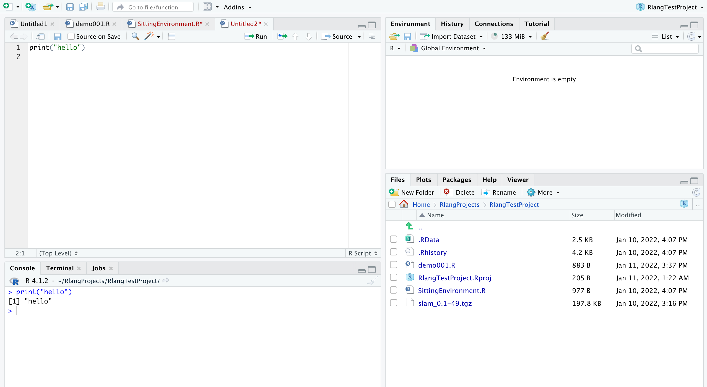

# R语言编译环境设置、编译器和软件包设置等
> 关键词： 编译环境、编译器、软件包设置

<!-- @import "[TOC]" {cmd="toc" depthFrom=1 depthTo=6 orderedList=false} -->

<!-- code_chunk_output -->

- [R语言编译环境设置、编译器和软件包设置等](#r语言编译环境设置-编译器和软件包设置等)
  - [一、环境安装与编译器](#一-环境安装与编译器)
    - [1. R环境](#1-r环境)
    - [2. 编译器](#2-编译器)
    - [3. 测试](#3-测试)
  - [二、 R语言环境](#二-r语言环境)
  - [三、 R语言软件包的安装与载入](#三-r语言软件包的安装与载入)
    - [1. 软件包的安装](#1-软件包的安装)

<!-- /code_chunk_output -->


## 一、环境安装与编译器
### 1. R环境
1. Windows： 
    https://cloud.r-project.org/bin/windows/base/
2. MacOS：
    https://cloud.r-project.org/bin/macosx/
3. Linux：
    https://cloud.r-project.org/bin/linux/

### 2. 编译器
RStudio： https://www.rstudio.com/

### 3. 测试



## 二、 R语言环境
1. 查看当前R环境版本
    ```r
    > version
                _                           
    platform       x86_64-apple-darwin17.0     
    arch           x86_64                      
    os             darwin17.0                  
    system         x86_64, darwin17.0          
    status                                     
    major          4                           
    minor          1.2                         
    year           2021                        
    month          11                          
    day            01                          
    svn rev        81115                       
    language       R                           
    version.string R version 4.1.2 (2021-11-01)
    nickname       Bird Hippie   
    ```

2. 安装包，如果已经有此包可跳过此步骤
    ```r
    install.packages("installr")
    ```

3. 加载包，升级
    ```r
    library(installr)
    updateR()
    ```


## 三、 R语言软件包的安装与载入

### 1. 软件包的安装
1. 查看当前已安装软件包
    ```r
    > # 查看当前已安装的包
    > library()
    ```

2. 安装软件包
    ```r
    # Step1-下载包(清华镜像)
    install.packages("tidyverse", repos = "https://mirrors.ustc.edu.cn/CRAN/")
    install.packages("usethis", repos = "https://mirrors.ustc.edu.cn/CRAN/")
    install.packages("devtools", repos = "https://mirrors.ustc.edu.cn/CRAN/")
    install.packages("showtext", repos = "https://mirrors.ustc.edu.cn/CRAN/")
    # if you have not installed the `devtools` package
    # install.packages("devtools") 
    library("devtools")
    install_github("kosukeimai/qss-package", build_vignettes = TRUE)
    ```

3. 删除软件包
    ```r
    # 彻底删除已安装的包：
    remove.packages(c("pkg1","pkg2"), lib=file.path("path", "to", "library"))
    ```

4. 