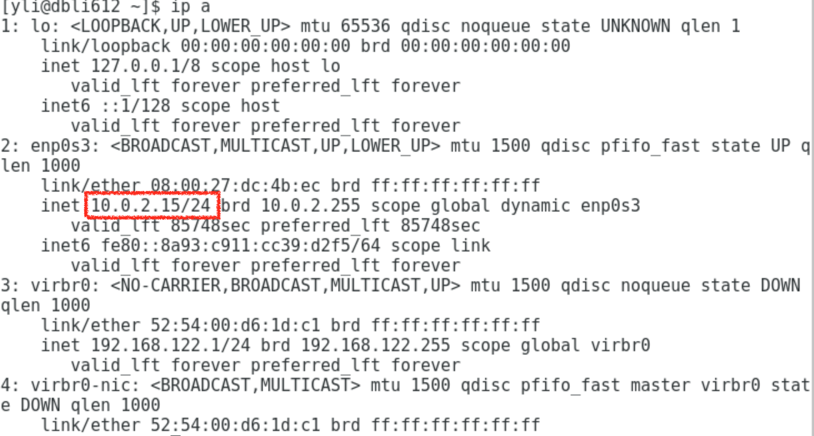

# VM VirtualBox 网络地址转换（NAT）使用详解

---
#### 连接方式1: 网络地址转换（NAT）
+ 主机可以ssh连接虚拟机
+ 虚拟机不能连接外网
#### 连接方式2: 桥接网卡
+ 主机可以连接虚拟机
+ 虚拟机可以连接外网  

---
### 连接方式1: 网络地址转换（NAT）
1. 查看虚拟机的IP地址  
    + 方法一：
        ```shell
        ip a
        ```
        同 ``ip addr``

        
    + 方法二：
        ```shell 
        ifconfig
        ```

         

    得，本例虚拟机IP为：10.0.2.15

2. 查看主机IP
    + Window PC：  
        打开cmd，输入```ifconfig```
    + MAC：  
        点击'系统偏好设置' > '网络' 就可以看到。
    
3. 设置VirtualBox   
    + 点开设置  
         
    + 点击上方导航栏的’网络‘，设置如下，该页设置完后点击**下方**‘端口转发‘：  
         
    + 端口转发设置如下   
        点击右边添加内容，然后输入表格内容
        

4. ssh连接
    ```shell
    ssh -p 2222 root@192.168.0.8
    ```
    

       
### 连接方式2: 桥接网卡
1. 关闭虚拟机

2. 查看主机IP
    + Window PC：  
        打开cmd，输入```ifconfig```
    + MAC：  
        点击'系统偏好设置' > '网络' 就可以看到。
        再点击右下角的'高级' 找到以下内容：
        
        

3. 设置VirtualBox
    打开VirtualBox， 点开相应虚拟机的设置：
     

    将网络设置如下图所示（该方法不用这种‘高级’选项）
     
    【注】本例“网卡1”是上一个方法，在执行本连接方式的时候已经将网卡1**关闭**，只开网卡2。

4. 启动虚拟机
    + 查看虚拟机的IP地址  
        + 方法一：
            ```shell
            ip a
            ```
            同 ``ip addr``
        + 方法二：
            ```shell 
            ifconfig
            ```

        得，本例虚拟机IP为：192.168.0.4

    + 修改网络配置文件
        ```shell
        cd /etc/sysconfig/network-scripts
        ls
        vi ifcfg-enp0s3
        ```
        修改如下内容：
        将``BOOTPROTO``改为 ``BOOTPROTO="static"``  
        增加内容：
        ```shell
        IPADDR=192.168.0.4
        NETMASK=255.255.255.0
        GATEWAY=192.168.0.1
        DNS1=192.168.0.1
        ```
        修改完成后完整文件内容为：  
        ```shell
        TYPE="Ethernet"
        PROXY_METHOD="none"
        BROWSER_ONLY="no"
        BOOTPROTO="static"
        DEFROUTE="yes"
        IPV4_FAILURE_FATAL="no"
        IPV6INIT="yes"
        IPV6_AUTOCONF="yes"
        IPV6_DEFROUTE="yes"
        IPV6_FAILURE_FATAL="no"
        IPV6_ADDR_GEN_MODE="stable-privacy"
        NAME="enp0s3"
        UUID="b60b95b9-f147-4eee-93a5-668bc74aaea4"
        DEVICE="enp0s3"
        ONBOOT="yes"
        IPADDR=192.168.0.4
        NETMASK=255.255.255.0
        GATEWAY=192.168.0.1
        DNS1=192.168.0.1
        ```  

5. 本机连接虚拟机：
     

6. 不能连接外网（ping）
    修改``vi /etc/resolv.conf``
    增加内容：
    ```shell
    # Generated by NetworkManager
    nameserver 192.168.0.1
    ```