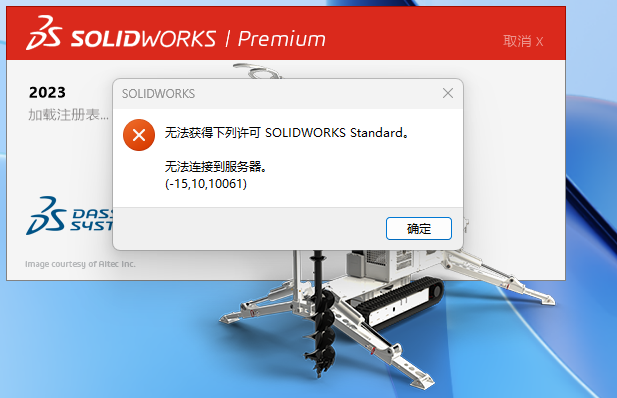
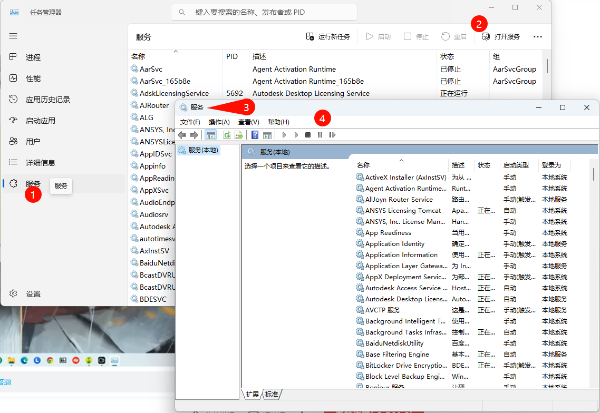
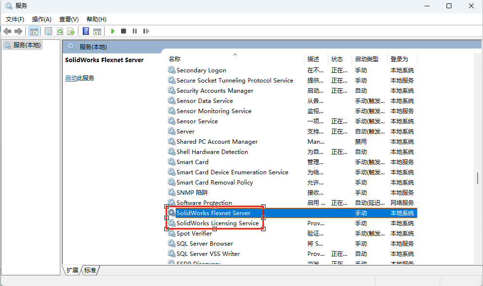
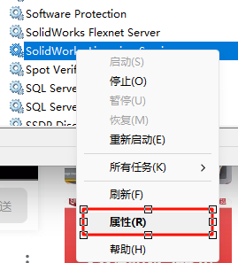
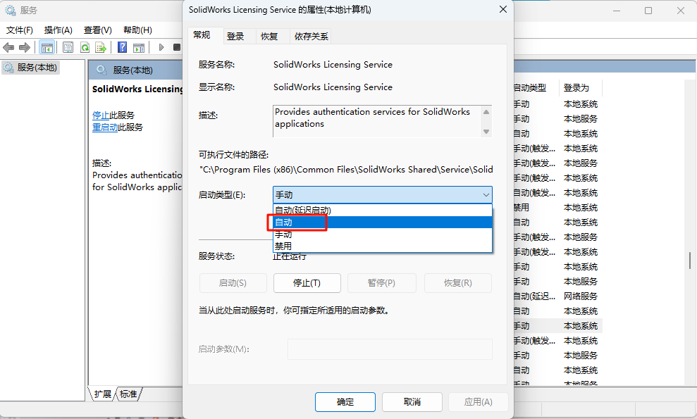

# 问题解决-SolidWorks打开软件遇到'无法获得下列许可SOLIDWORKSStandard'问题解决 
> 图片目录231219img

## 1. 问题描述
见图片

## 2. 问题解决
1. 打开任务管理器
    1点击"服务" -> 2右上角"打开服务" -> 3弹出"服务"窗口
    > 图中标签4没用
    
    
2. 在服务窗口找到"SolidWorks Flexnet Server" 和 "SolidWorks Licensing Service"两个服务
    
    
3. 启动两个服务, 并设置为"自动"  
    + 鼠标右键, 点击"启动";
    + 再点击"属性"
        
        启动类型设置为自动
        
    
    将两个服务都启动, 且设置为自动.