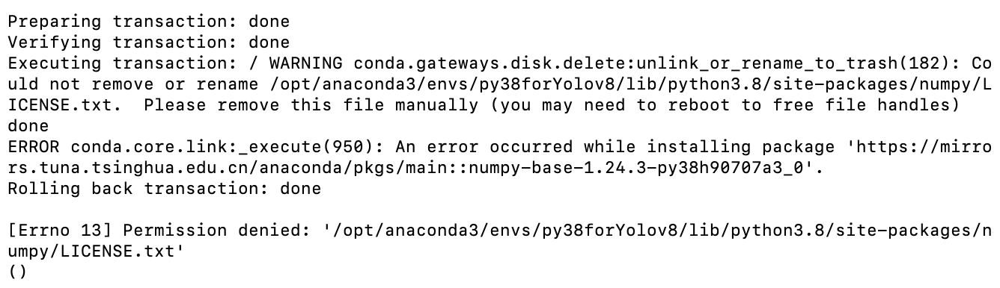
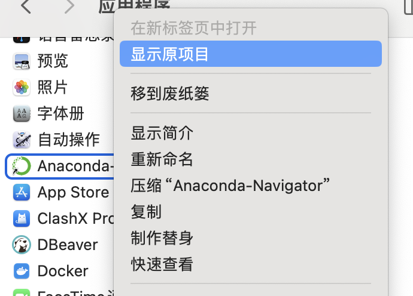
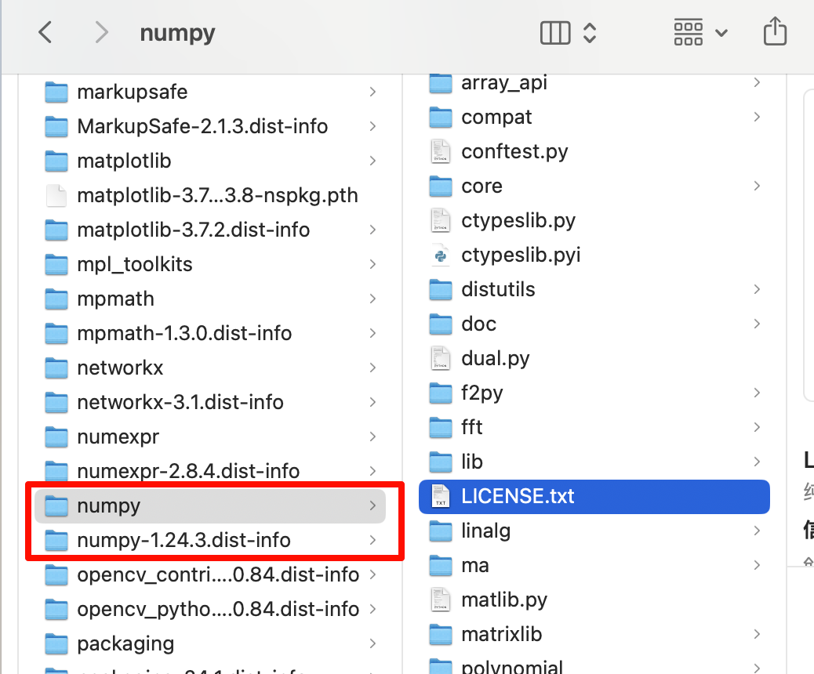

# 问题解决-pip或conda下载解决汇总


<!-- @import "[TOC]" {cmd="toc" depthFrom=2 depthTo=6 orderedList=false} -->

<!-- code_chunk_output -->

- [一. conda下载报错, 提示需要删除某文件, 提示`Executing transaction: \ WARNING conda.gateways.disk.delete:unlink_or_rename_to_trash(182)`](#一-conda下载报错-提示需要删除某文件-提示executing-transaction--warning-condagatewaysdiskdeleteunlink_or_rename_to_trash182)
  - [问题描述](#问题描述)
  - [解决方法](#解决方法)
- [二. pip安装，出现报错`ERROR: Could not find a version that satisfies the requirement XXX (from versions: none)`](#二-pip安装出现报错error-could-not-find-a-version-that-satisfies-the-requirement-xxx-from-versions-none)
  - [问题描述](#问题描述-1)
  - [解决方法](#解决方法-1)
- [三. 不好下载的包](#三-不好下载的包)
  - [3.1 下载cv2](#31-下载cv2)

<!-- /code_chunk_output -->


## 一. conda下载报错, 提示需要删除某文件, 提示`Executing transaction: \ WARNING conda.gateways.disk.delete:unlink_or_rename_to_trash(182)`
### 问题描述
运行`conda`下载时, 如`conda install pytorch::pytorch torchvision torchaudio -c pytorch`. 
下载后报错如下, 见截图


### 解决方法
1. 找到提示所说的目录, `/opt/anaconda3/envs/py38forYolov8/lib/python3.8/site-packages/numpy/LICENSE.txt`
    目录`opt`在mac上是隐藏文件夹,可以在应用程序里进入
    
    
2. 见文件如下
    
    报错提示要删除`LICENSE.txt`, 但删除文件没用, 直接将上级目录`numpy`和`numpy-1.24.3.dist-info`删除, 然后再重新安装`numpy`即可.

3. 可重新安装开始需要安装的库文件


## 二. pip安装，出现报错`ERROR: Could not find a version that satisfies the requirement XXX (from versions: none)`

### 问题描述  
pip安装，出现报错`ERROR: Could not find a version that satisfies the requirement XXX (from versions: none)`

### 解决方法
> 问题原因:国内环境不稳定
1. 使用镜像安装  
    ```shell
    $ pip3 install 包名 -i http://pypi.douban.com/simple/ --trusted-host pypi.douban.com
    ```
    
    镜像链接也可换为：
    + 阿里云 http://mirrors.aliyun.com/pypi/simple/ 
        + 豆瓣(douban) http://pypi.douban.com/simple/ 
        + 清华大学 https://pypi.tuna.tsinghua.edu.cn/simple/ 
        + 中国科学技术大学 http://pypi.mirrors.ustc.edu.cn/simple/
2. VPN

## 三. 不好下载的包
### 3.1 下载cv2
1. 终端命令
    ```bash
    sudo pip install opencv-python -i https://mirrors.aliyun.com/pypi/simple/    
    ``` 
    ```bash
    sudo pip install opencv-contrib-python -i https://mirrors.aliyun.com/pypi/simple/
    ```


## 3.2 安装d2l
根据官网安装教程安装d2l库，可参考[d2l官网](https://zh-v2.d2l.ai/chapter_installation/index.html)
要求运行命令行
```bash
pip install d2l==0.17.6
```
但是会报错
```
      [end of output]
  
  note: This error originates from a subprocess, and is likely not a problem with pip.
  ERROR: Failed building wheel for pandas
Failed to build pandas
ERROR: ERROR: Failed to build installable wheels for some pyproject.toml based projects (pandas)
```
无法安装pandas库，解决方法如下：换d2l版本
```bash
pip install d2l==0.17
```


